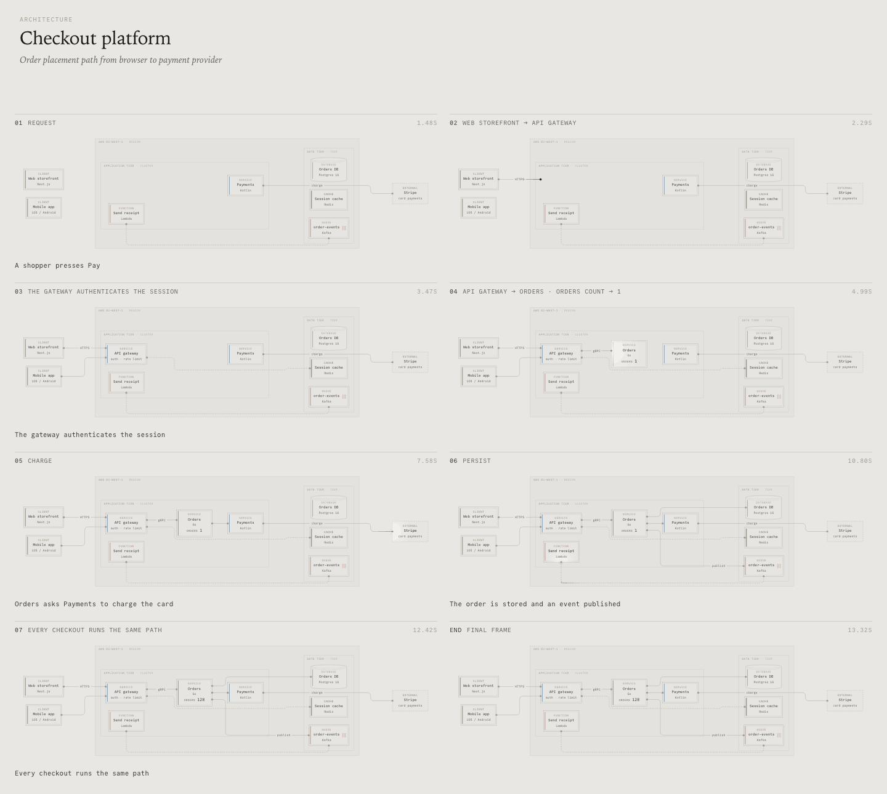
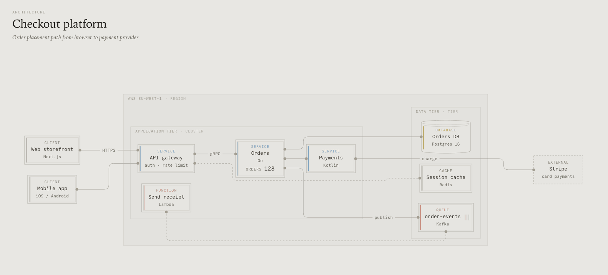
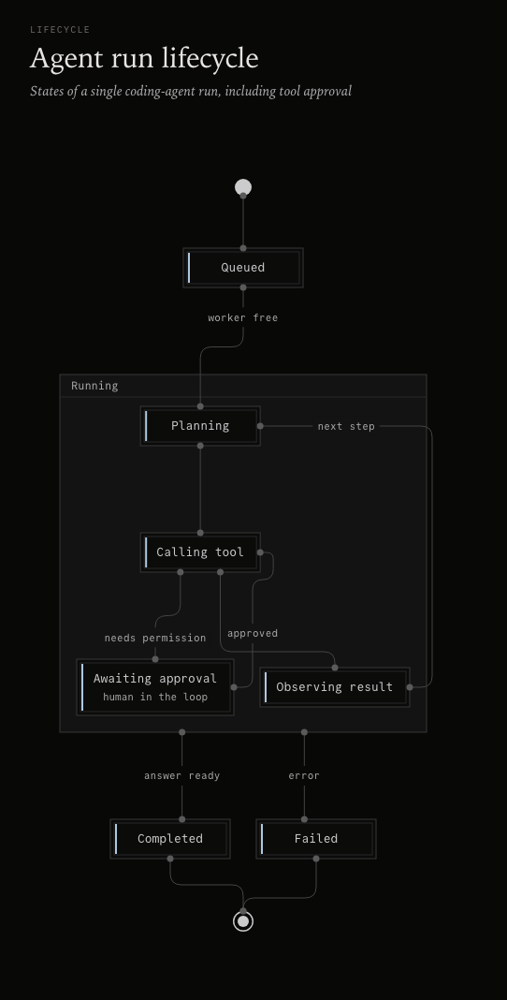
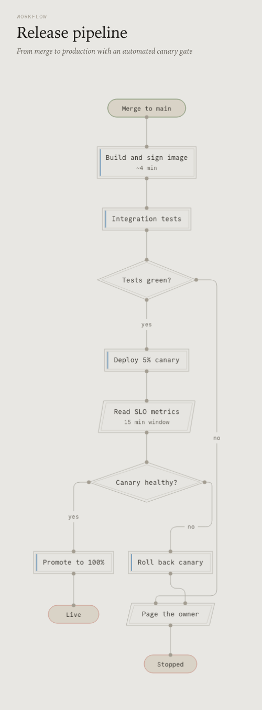
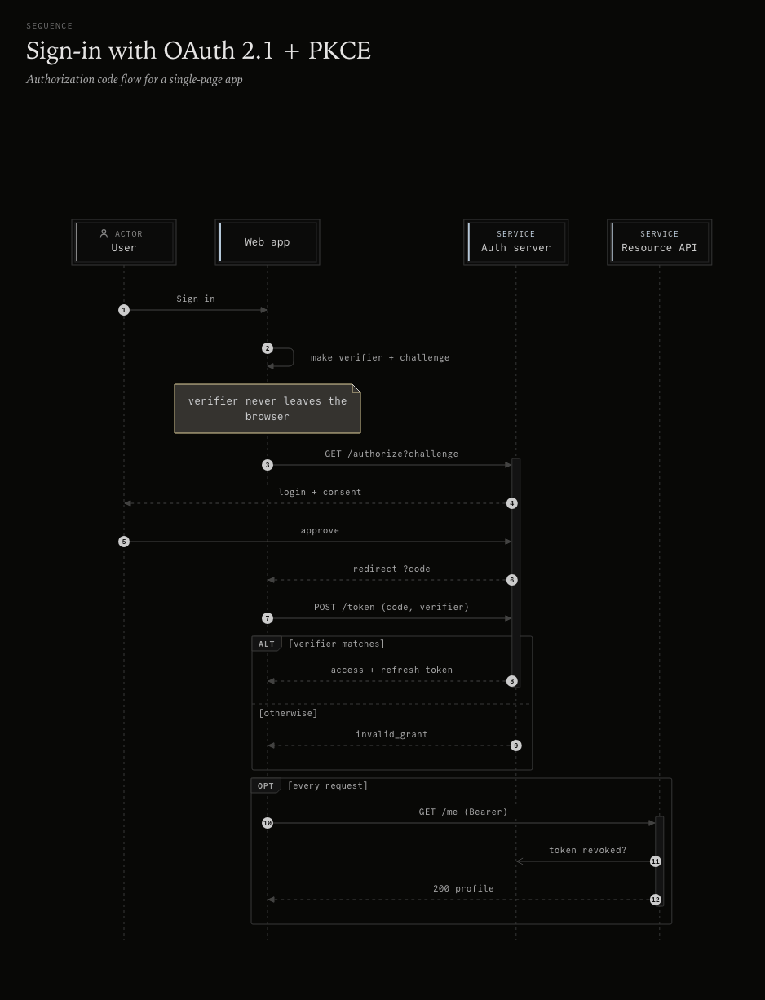
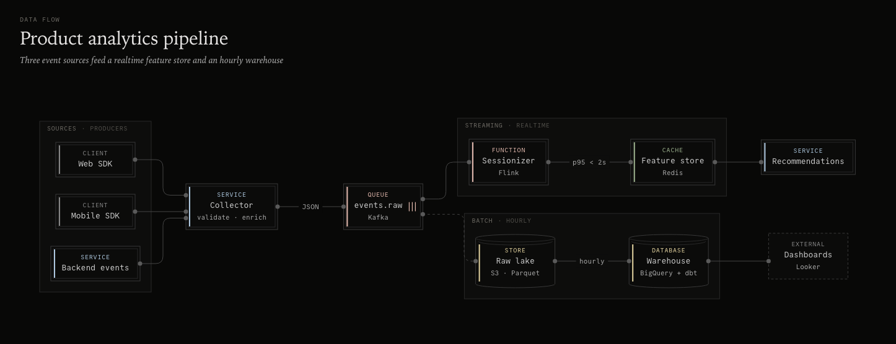
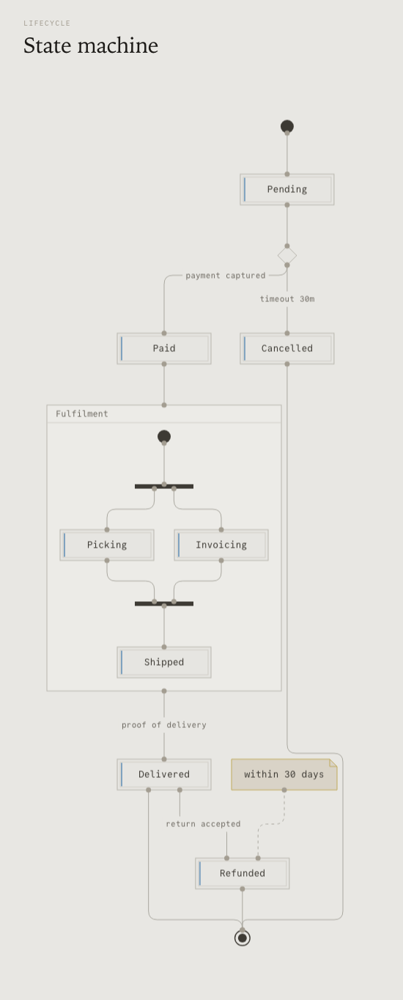
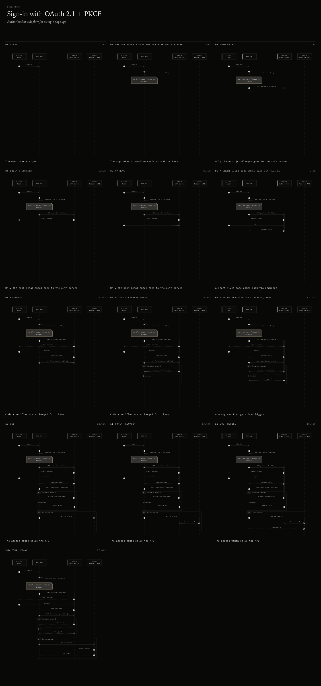
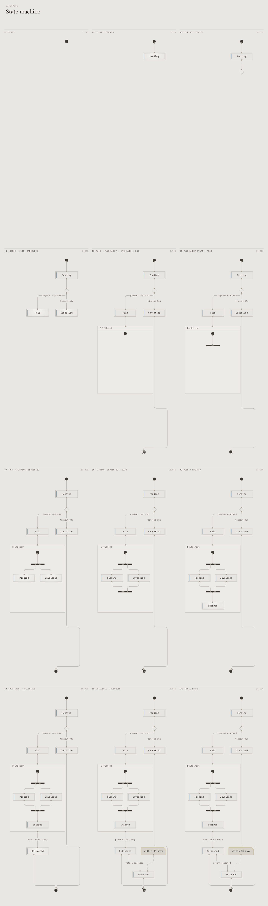

# storyink

Architecture, workflow, sequence, data-flow and lifecycle diagrams from a small JSON spec (or
Mermaid) into **one offline HTML file** (a React + Motion viewer over server-rendered SVG) and a
**static SVG**. Warm ink-on-paper style with Commit Mono labels, light and dark themes.

One package, four ways to use it: library, CLI, OpenCode plugin, and a skill for other agents.

<picture>
  <source media="(prefers-color-scheme: dark)" srcset="https://raw.githubusercontent.com/grenaad/storyink/main/docs/gallery/checkout.architecture.animated.dark.svg">
  
</picture>

<picture>
  <source media="(prefers-color-scheme: dark)" srcset="https://cdn.jsdelivr.net/gh/grenaad/storyink@main/docs/gallery/oauth.sequence.animated.dark.svg">
  
</picture>

*Animated SVGs (SMIL, no script): they play inside a plain ``, so in a README or a PR
comment too. See [Animated SVG](#animated-svg-readmes-and-prs).*

```sh
npx storyink render examples/checkout.architecture.json -o checkout.html --svg checkout.svg
```

The HTML has no external requests. It includes pan/zoom (wheel at the cursor, drag, `+`/`-`/`0`,
fit on load), a theme toggle that follows `prefers-color-scheme` and is saved in `localStorage`,
SVG export, and 2× PNG export. It also works without JavaScript.

## 1. Library

```ts
import { validate, fromMermaid, renderHtml, renderSvg, layout } from "storyink/core" // browser-safe
import { writeDiagram, snapshot, findBrowser } from "storyink/node" // Node only

const v = validate(spec) // { ok, diagnostics: [{ severity, path, message, hint }], spec }
const html = renderHtml(v.spec!) // standalone page
const svg = renderSvg(v.spec!, { theme: "dark" }) // omit theme to follow prefers-color-scheme
const scene = layout(v.spec!) // absolute geometry with stable ids (nodes, groups, edges, ports, labels)
const m = fromMermaid("flowchart LR\n a --> b") // { ok, spec, diagnostics }
```

`storyink/core` has no Node APIs. The viewer bundle and the font are compiled in as string
modules, so it works with bundlers and in the browser. `storyink` (the root export) re-exports
both and has the OpenCode plugin as its default export. Runs on Node ≥ 20 and Bun.

## 2. CLI

```
storyink render <in.json|in.mmd|-> [-o out.html] [--svg out.svg] [--theme light|dark] [--story auto]
                [--motion full|reduced|system] [--camera follow|fit]
                [--animated-svg out.svg [--theme light|dark|both] [--once] [--font system|embed]]
storyink mermaid <in.mmd> [-o out.json]
storyink validate <in> [--json]
storyink snapshot <out.html> [--theme light,dark] [--width N] [--sheet [themes|beats]|--no-sheet] [--at 0.5,1.2,end] [--scale 2] [-o dir] [--json]
                  [--preview out.jpg [--preview-size 1024]] [--motion reduced] [--camera follow]
storyink skill
```

`snapshot` finds a browser in this order: `$STORYINK_CHROME`, then the newest Playwright
`chrome-headless-shell`, then system Chrome (`--headless=new`). It writes one PNG per theme and
a light|dark contact sheet, reads the in-page lint through `--dump-dom`, and writes a receipt
JSON containing the browser, flags, sha256 of each image, lint results and gates. Exit codes:
0 pass, 1 gate failed, 2 no browser.

## 3. OpenCode plugin

From npm (once published), pinned or not:

```jsonc
// opencode.json (global ~/.config/opencode/ or project .opencode/)
{ "plugins": ["storyink"] }            // or "storyink@0.1.0"
```

From a local checkout, for development: build first, then point `plugins` at the **directory**
(OpenCode v2 accepts directories here, not single files):

```sh
cd ~/projects/storyink && bun install && bun run build
```

```jsonc
// <project>/.opencode/opencode.json
{ "plugins": ["/absolute/path/to/storyink"] }
```

OpenCode resolves a local plugin directory as `<dir>/server` and then `<dir>/index`. It does not
read `package.json` `main`, which is why the repo ships a root `server.js` that re-exports
`dist/index.js`. npm packages resolve `storyink/server` and then `storyink`, and both are exported.
Rebuild after changes, then restart the server (or touch the config) to reload.

This adds the tools `storyink_render`, `storyink_from_mermaid`, `storyink_validate` and
`storyink_snapshot`. `storyink_snapshot` returns **one compact preview image** so the model can see its
own render: a JPEG no larger than `maxImageSize` (1024 px by default) on its longest side, and
usually well under 300 KB.
- Beat sheets are reflowed into more columns so they fit in that single image.
- Set `image: "full"` to get the normal sheet layout instead, split into at most 3 parts, or
  `image: "none"` to get paths only.
- Full-resolution PNGs are never inlined; they stay on disk and their paths are listed. The CLI
  equivalent is `--preview out.jpg`. The plugin also adds the `storyink` skill (`skill/SKILL.md`), which covers
choosing a diagram type, writing the spec, and the render → look → fix loop. If you already have
a skill with the id `storyink`, yours is kept. Relative paths resolve against the project
directory.

## 4. Other agents

Use the CLI, and install the skill from the package:

```sh
npx storyink skill        # prints the SKILL.md path and its content
```

An MCP server is planned.

## Storyboards (opt-in)

Add a `story` to play a diagram as a sequence of beats in the HTML viewer:
- nodes reveal;
- wires draw on under a travelling pulse;
- arrivals glow;
- captions type in;
- counters roll (via [@kitlangton/rolling-number](https://github.com/kitlangton/rolling-number)).

`"story": "auto"` (or `--story auto`) derives the beats from the graph or message order. Playback
has a click-to-play gate, play/pause, a tape-rewind replay and a scrubber with step and chapter
ticks. Space, ←/→ and R control it.

Motion is **full by default, even when the reader's system asks for reduced motion**. Authors can
set `"story": { "motion": "reduced" }` (always step by step) or `"motion": "system"` (follow
`prefers-reduced-motion`); `--motion full|reduced|system` on `render` does the same, including
for auto stories. Readers switch with the toolbar's **Motion** toggle (`M`, remembered), and
`#motion=full|reduced` overrides everything. In reduced mode Play walks the story step by step:
each step's settled state shown at once and held for its reading time, with no travelling pulses
or tweens, and the page opens on the final frame.

The camera **follows the story** while it plays. When the whole diagram would render its labels
too small, Play zooms to a readable scale and pans from step to step, moving only when the active
step leaves the middle 80 % of the view, then eases back to fit at the end. Your own zoom is kept
and a drag pauses following until the next step that is out of view. Toggle it with **Follow**
(`F`, remembered), `#camera=fit`, or `"story": { "camera": "fit" }` / `--camera fit`.
`storyink snapshot --camera follow --at …` captures the followed view.

The final frame is always the static diagram. Every frame is a pure function of time
(`storyState(scene, timeline, t)`), so `#t=2.5` seeks exactly and
`storyink snapshot --at 1,2.5,end --sheet beats` renders stills and a beat contact sheet. The
receipt gates check that the end frame and the reduced-motion page match the static diagram. See
[docs/spec.md](docs/spec.md#storyboard-story-opt-in).



## Animated SVG (READMEs and PRs)

GitHub shows images in READMEs and PR comments as a plain `` through its camo proxy, so no
script runs and nothing outside the file loads. `--animated-svg` compiles the story into **SMIL**
inside one self-contained SVG that plays there:

```sh
storyink render examples/checkout.architecture.json --animated-svg docs/checkout.svg --theme both
# wrote docs/checkout.light.svg, docs/checkout.dark.svg and prints:
```

```html
<picture>
  <source media="(prefers-color-scheme: dark)" srcset="docs/checkout.dark.svg">
  
</picture>
```

- An SVG image doesn't follow the page theme, so each file is **pinned** to one theme; the
  `<picture>` picks one. `--theme light|dark` writes a single file.
- It loops: story, a 3 s hold on the final frame, a 0.4 s reset. `--once` plays once and freezes.
- The attributes' base values are the final frame, so viewers without SMIL show the static diagram.
- Fonts: `--font system` (default) uses the system mono stack; `--font embed` embeds Commit Mono
  (+~127 KB) for the exact look. See the size table in [docs/spec.md](docs/spec.md#animated-svg).
- No story in the spec? The auto story is used (with a warning).
- Library: `renderAnimatedSvg(spec, { theme, once, font })` from `storyink/core`; plugin:
  `storyink_render` with `animatedSvg: true | "both"`, `once`, `font`.
- GitHub's image proxy caches by URL: when a diagram changes, give it a new file name (or URL).

## Gallery

`bun run gallery` renders every example and Mermaid sample and writes one light and one dark PNG per
example to `docs/gallery/`. `bun run gallery:animated` writes the animated SVGs of the story
examples (`*.animated.light.svg` / `*.animated.dark.svg`); `bun run verify:smil` checks them in
headless Chrome (frame parity with the viewer's frames, `` playback, embedded font).

| | |
| --- | --- |
|  |  |
|  |  |
|  |  |
|  |  |

## Spec

See [docs/spec.md](docs/spec.md) and [schema/storyink.schema.json](schema/storyink.schema.json).
Graph edges have no arrowheads by default, matching Kit's style. Set `"style": { "arrowheads": true }`
to draw them. If you leave out `direction`, the layout picks TB or LR, whichever gets the aspect
ratio closer to 16:10.
Examples of each type are in [examples/](examples), and Mermaid samples are in
[examples/mermaid/](examples/mermaid).

## Develop

```sh
bun install
bun test          # generates src/generated/* first
bun run typecheck
bun run build     # dist/ (ESM for node, .d.ts, CLI with a node shebang)
bun run gallery   # docs/gallery/*.png (needs Chrome / Playwright headless shell)
```

All design tokens (palette, type, geometry, motion) live in `src/theme/tokens.ts` and are
exported as CSS variables.

## License

MIT © 2026 grenaad. The bundled font and libraries are listed in
[THIRD_PARTY_NOTICES.md](THIRD_PARTY_NOTICES.md).
