# storyink

Architecture, data-flow, workflow, sequence and lifecycle diagrams from a small JSON spec (or
Mermaid), in a warm ink-on-paper style with Commit Mono labels, light and dark. A diagram can play
as a **story**, show a code change as a **change diagram** or a **change story**, and sit in a
**page** that you read, scroll through (scrollytelling) or present as **slides**. Everything renders
to **one offline HTML file** (a React + Motion viewer over server-rendered SVG) and a **static
SVG**; stories also compile to an **animated SVG** that plays inside a plain ``, so in READMEs
and PR comments too.

One package, four ways to use it: library, CLI, OpenCode plugin, and a skill for other agents.

<picture>
  <source media="(prefers-color-scheme: dark)" srcset="https://raw.githubusercontent.com/grenaad/storyink/main/docs/gallery/checkout-recovery.architecture.animated.dark.svg">
  
</picture>

**Checkout recovery** ([spec](examples/checkout-recovery.architecture.json)): a pager row types in,
the agent's diagnosis script types out with syntax colours, its active lines light up as it
queries `metrics` and probes both pools in parallel, the triage row ends in a cross, then the
program is swapped for a traffic shift: the wire to `pool-a` is retired, staggered requests flow
to `pool-b`, and a verification query closes the incident with a check. One JSON file, ~20 s.

<picture>
  <source media="(prefers-color-scheme: dark)" srcset="https://cdn.jsdelivr.net/gh/grenaad/storyink@main/docs/gallery/oauth.sequence.animated.dark.svg">
  
</picture>

*Animated SVGs (SMIL, no script): they play inside a plain ``, so in a README or a PR
comment too. See [Animated SVG](#animated-svg-readmes-and-prs).*

## Quick start

```sh
npx storyink render examples/checkout.architecture.json -o checkout.html --svg checkout.svg
npx storyink snapshot checkout.html -o shots     # light + dark PNGs, a contact sheet, lint, a receipt
npx storyink diff main...HEAD -o changes.json    # your branch's diff, parsed
npx storyink render change.json --changes changes.json -o change.html   # real +/− and hunks
```

`change.json` is a [change diagram](#change-diagrams) whose boxes point at files; `--changes` fills
in their `+/−`, resolves [diff code nodes](#diffs-and-diff-code-nodes) and embeds the hunks.

> The npm release is 0.4.0. Everything under *Unreleased* in the [changelog](CHANGELOG.md)
> (change diagrams, `storyink diff` and `--changes`, narration and the drawer, pages,
> scrollytelling and slides) is on `main`; until the next release, run it from a checkout
> (`bun install && bun run build`, then `node dist/cli.js …`).

The HTML has no external requests. It includes pan/zoom (wheel at the cursor, drag, `+`/`-`/`0`,
fit on load), a theme toggle that follows `prefers-color-scheme` and is saved in `localStorage`,
SVG export and 2× PNG export (of the final frame, or of the frame on screen with **Frame: now**).
It also works without JavaScript.

## Showcase

<table>
<tr>
<td width="33%" valign="top"><a href="#diagram-types"><picture><source media="(prefers-color-scheme: dark)" srcset="docs/gallery/checkout.architecture.dark.png">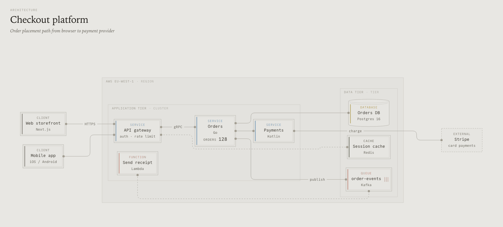</picture></a><br><b>Diagram types</b><br><sub>five types, one JSON shape, Mermaid in</sub></td>
<td width="33%" valign="top"><a href="#storyboards"><picture><source media="(prefers-color-scheme: dark)" srcset="docs/gallery/checkout.architecture.beats.dark.png">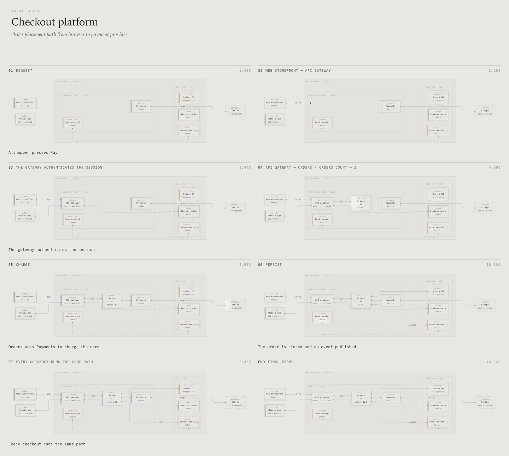</picture></a><br><b>Storyboards</b><br><sub>beats, chapters, reading holds, follow camera</sub></td>
<td width="33%" valign="top"><a href="#rich-nodes-and-content-steps"><picture><source media="(prefers-color-scheme: dark)" srcset="docs/gallery/failover.dataflow.animated.dark.svg"></picture></a><br><b>Rich nodes</b><br><sub>panels, code and chips; typing, status, wires</sub></td>
</tr>
<tr>
<td valign="top"><a href="#change-diagrams"><picture><source media="(prefers-color-scheme: dark)" srcset="docs/gallery/batch-email.dataflow.dark.png">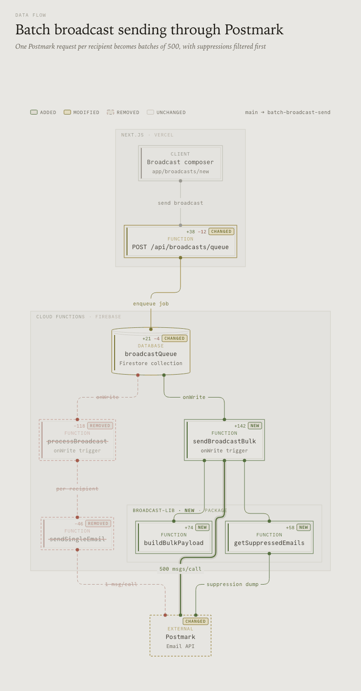</picture></a><br><b>Change diagrams</b><br><sub>added, changed, removed; +/−; hero edge</sub></td>
<td valign="top"><a href="#diffs-and-diff-code-nodes"><picture><source media="(prefers-color-scheme: dark)" srcset="docs/gallery/storyink-core.architecture.dark.png">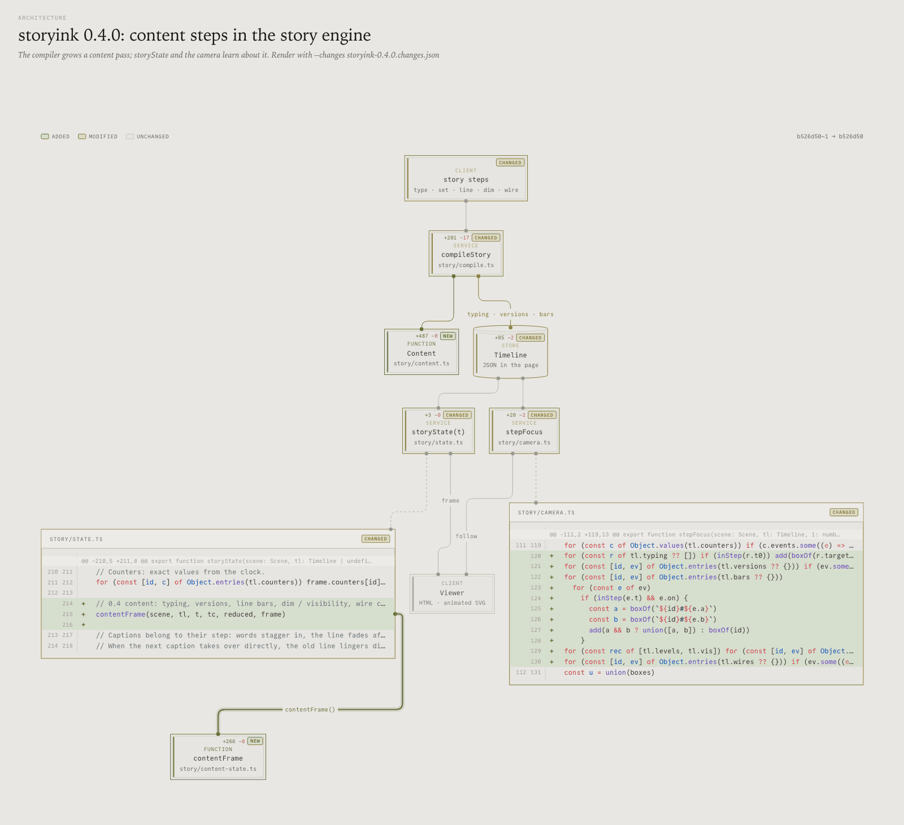</picture></a><br><b>Diffs</b><br><sub><code>storyink diff</code>, <code>--changes</code>, diff code nodes</sub></td>
<td valign="top"><a href="#change-stories"><picture><source media="(prefers-color-scheme: dark)" srcset="docs/gallery/cache-layer.architecture.beats.dark.png">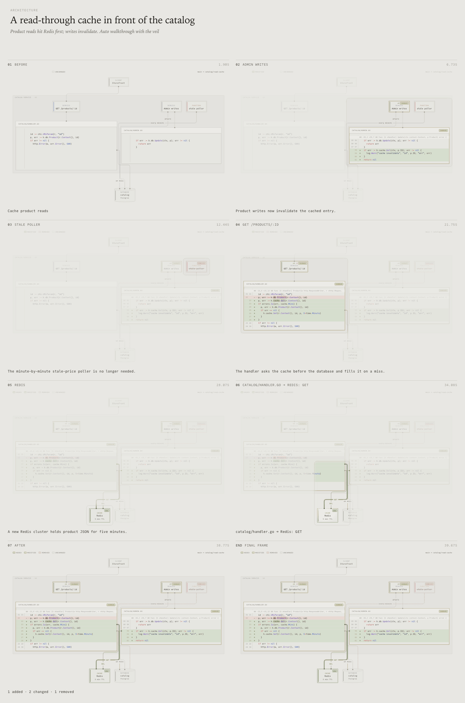</picture></a><br><b>Change stories</b><br><sub><code>"story": "changes"</code> with the veil</sub></td>
</tr>
<tr>
<td valign="top"><a href="#narration-and-drawer"><picture><source media="(prefers-color-scheme: dark)" srcset="docs/gallery/storyink-0.4.0.rail.dark.png">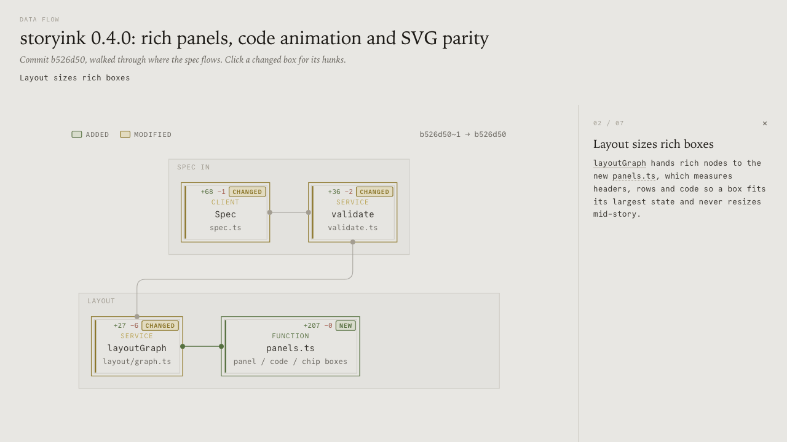</picture></a><br><b>Narration rail</b><br><sub>narrated steps with cites</sub></td>
<td valign="top"><a href="#narration-and-drawer"><picture><source media="(prefers-color-scheme: dark)" srcset="docs/gallery/storyink-0.4.0.drawer.dark.png">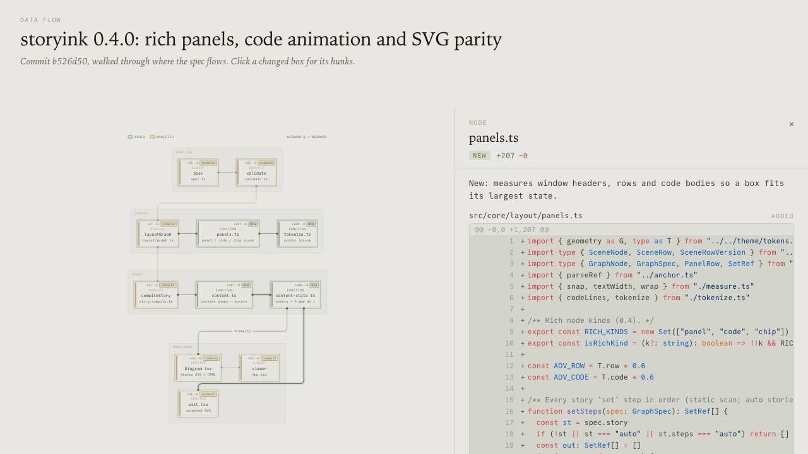</picture></a><br><b>Change drawer</b><br><sub>click a box for its real hunks</sub></td>
<td valign="top"><a href="#pages"><picture><source media="(prefers-color-scheme: dark)" srcset="docs/gallery/pr-review.page.dark.png">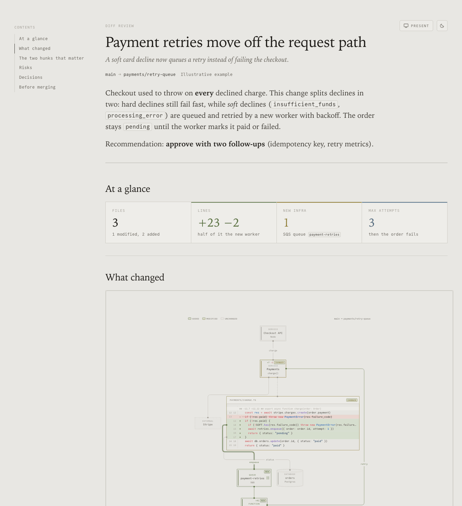</picture></a><br><b>Pages</b><br><sub>reviews, plans and recaps with live figures</sub></td>
</tr>
<tr>
<td valign="top"><a href="#scrollytelling"><picture><source media="(prefers-color-scheme: dark)" srcset="docs/gallery/payment-retry.scrolly.step3.dark.png">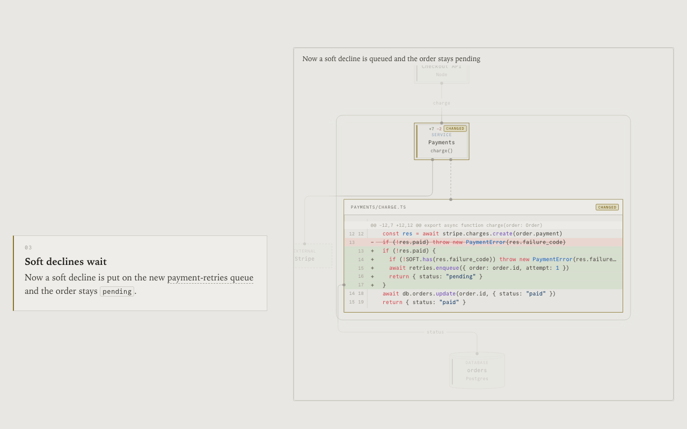</picture></a><br><b>Scrollytelling</b><br><sub>the figure follows the text</sub></td>
<td valign="top"><a href="#slides"><picture><source media="(prefers-color-scheme: dark)" srcset="docs/gallery/pr-review.deck.slide3-build4.dark.png">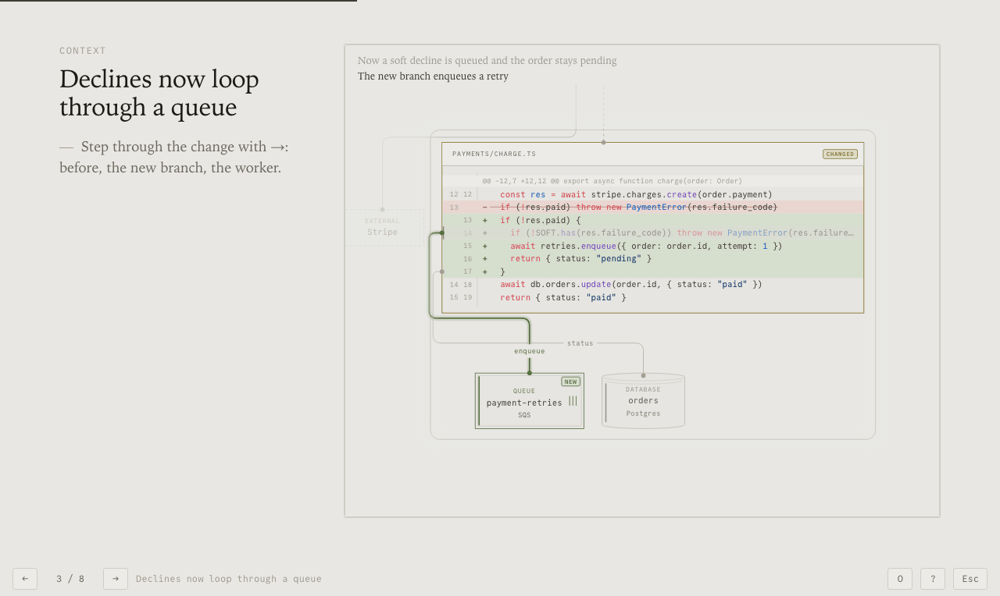</picture></a><br><b>Slides</b><br><sub>present any page; builds step the figure</sub></td>
<td valign="top"><a href="#animated-svg-readmes-and-prs"><picture><source media="(prefers-color-scheme: dark)" srcset="docs/gallery/auth-session-to-jwt.sequence.animated.dark.svg"></picture></a><br><b>Animated SVG</b><br><sub>SMIL inside a plain <code>&lt;img&gt;</code></sub></td>
</tr>
</table>

## Diagram types

Five types share one spec shape. Graphs (`architecture`, `dataflow`, `workflow`, `lifecycle`) have
`nodes`, `edges` and `groups` and lay themselves out; a `sequence` has `participants` and ordered
`messages`.

<table>
<tr>
<td valign="top"><picture><source media="(prefers-color-scheme: dark)" srcset="docs/gallery/checkout.architecture.dark.png"></picture><br><code>architecture</code> · <a href="examples/checkout.architecture.json">spec</a></td>
<td valign="top"><picture><source media="(prefers-color-scheme: dark)" srcset="docs/gallery/analytics.dataflow.dark.png">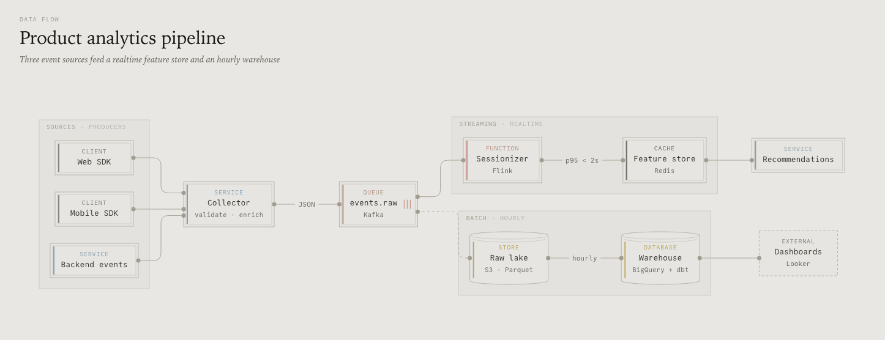</picture><br><code>dataflow</code> · <a href="examples/analytics.dataflow.json">spec</a></td>
<td valign="top"><picture><source media="(prefers-color-scheme: dark)" srcset="docs/gallery/oauth.sequence.dark.png">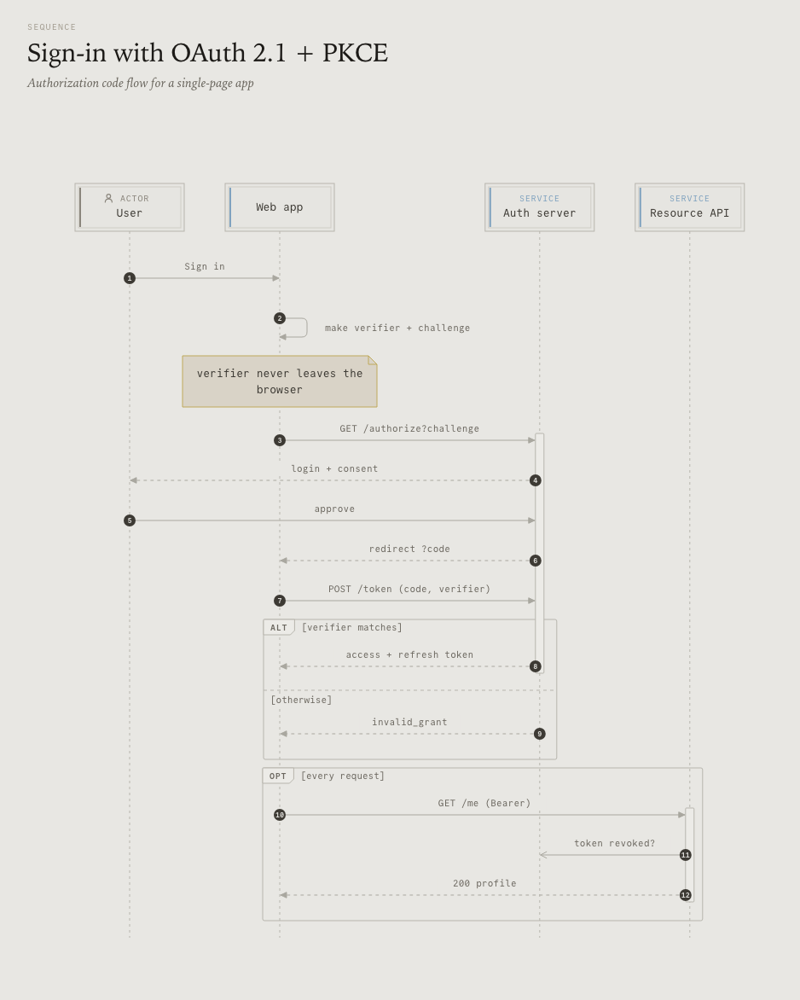</picture><br><code>sequence</code> · <a href="examples/oauth.sequence.json">spec</a></td>
</tr>
<tr>
<td valign="top"><picture><source media="(prefers-color-scheme: dark)" srcset="docs/gallery/release.workflow.dark.png">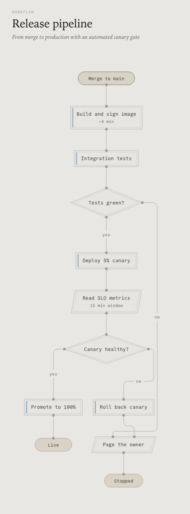</picture><br><code>workflow</code> · <a href="examples/release.workflow.json">spec</a></td>
<td valign="top"><picture><source media="(prefers-color-scheme: dark)" srcset="docs/gallery/agent-run.lifecycle.dark.png">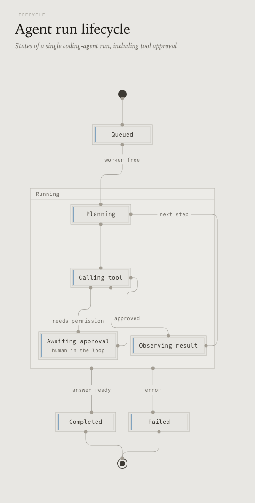</picture><br><code>lifecycle</code> · <a href="examples/agent-run.lifecycle.json">spec</a></td>
<td valign="top"><picture><source media="(prefers-color-scheme: dark)" srcset="docs/gallery/order.state.dark.png">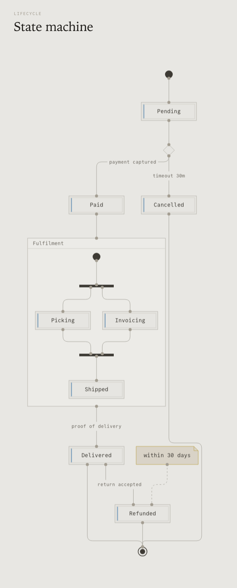</picture><br>Mermaid · <a href="examples/mermaid/order.state.mmd">order.state.mmd</a></td>
</tr>
</table>

```json
{
  "type": "architecture",
  "title": "Checkout",
  "subtitle": "Order path from browser to payment provider",
  "direction": "LR",
  "style": { "arrowheads": true },
  "groups": [
    { "id": "aws", "label": "AWS eu-west-1", "kind": "region" },
    { "id": "app", "label": "Application tier", "kind": "cluster", "parent": "aws", "direction": "TB" }
  ],
  "nodes": [
    { "id": "web", "label": "Web storefront", "kind": "client", "detail": "Next.js" },
    { "id": "orders", "label": "Orders", "kind": "service", "detail": "Go", "parent": "app" },
    { "id": "db", "label": "Orders DB", "kind": "database", "tag": "primary", "parent": "aws" },
    { "id": "stripe", "label": "Stripe", "kind": "external" },
    { "id": "why", "label": "Writes are idempotent", "kind": "note" }
  ],
  "edges": [
    { "from": "web", "to": "orders", "label": "HTTPS", "style": "thick" },
    { "from": "orders", "to": "db", "style": "dashed", "arrow": "both" },
    { "from": "orders", "to": "stripe", "label": "charge" },
    { "from": "why", "to": "db", "style": "dashed", "arrow": "none" }
  ]
}
```

| type | node kinds (shape / accent) |
| --- | --- |
| `architecture`, `dataflow` | `service` `function` `database` `store` `cache` `queue` `client` `user` `external`, plus `note` and the [rich nodes](#rich-nodes-and-content-steps) `panel` `code` `chip` |
| `workflow` | `start` `end` `step` `decision` `io`, plus `note` `panel` `code` `chip` |
| `lifecycle` | `initial` `final` `state` `composite` `choice` `fork` `join`, plus `note`; children of a `composite` set `parent` to it |
| `sequence` participants | `participant` `actor` `service` `database` `queue` `external` |

- **Direction.** Leave out `direction` and the layout tries TB and LR and keeps the one whose aspect
  ratio is closer to 16:10; `TB` (`TD`), `BT`, `LR`, `RL` pin it. Groups (and lifecycle composites)
  take their own `direction`.
- **Arrowheads.** Graph edges have none by default (Kit's style: direction reads from the layout);
  `"style": { "arrowheads": true }` draws them, and each edge's `arrow` (`end`, `both`, `none`)
  applies. Sequences always have heads.
- **Labels** wrap at 26 characters; put technology in `detail`. `tag` is the small uppercase line
  (`""` hides it). A `note` is a sticky note; join it with a dashed `"arrow": "none"` edge.

A sequence, with every part it supports:

```json
{
  "type": "sequence", "title": "Login", "autonumber": true,
  "participants": [{ "id": "u", "label": "User", "kind": "actor" }, { "id": "api", "kind": "service" }, { "id": "db", "kind": "database" }],
  "boxes": [{ "label": "Backend", "participants": ["api", "db"] }],
  "messages": [
    { "id": "req", "from": "u", "to": "api", "label": "POST /login" },
    { "from": "api", "to": "db", "label": "SELECT user" },
    { "from": "db", "to": "api", "label": "row", "kind": "return" },
    { "from": "api", "to": "api", "label": "verify hash", "kind": "self" },
    { "from": "api", "to": "u", "label": "200 + cookie", "kind": "return" },
    { "from": "api", "to": "u", "label": "401", "kind": "return" }
  ],
  "activations": [{ "participant": "api", "start": "req", "end": 5 }],
  "notes": [{ "text": "bcrypt, cost 12", "right": "api", "after": 3 }],
  "frames": [{ "kind": "alt", "label": "valid", "start": 4, "end": 5, "sections": [{ "label": "else", "start": 5 }] }],
  "bands": [{ "start": 1, "end": 2, "label": "lookup" }]
}
```

Message kinds: `sync` (default), `async`, `return`, `self` (automatic when `from === to`). Message
references (`start`, `end`, `after`) are 0-based indices or message `id`s. Frames: `alt` `opt`
`loop` `par` `critical` `break`. Notes sit `over` one or two participants, `left` or `right`.

**Mermaid in.** `flowchart` / `graph` becomes a workflow, `sequenceDiagram` a sequence and
`stateDiagram` / `stateDiagram-v2` a lifecycle; what has no equivalent (`classDef`, `style`,
`click`…) is a warning, never a crash.

```sh
storyink render examples/mermaid/incident.flowchart.mmd -o incident.html   # render Mermaid directly
storyink mermaid examples/mermaid/order.state.mmd -o order.json           # or convert, then refine the JSON
cat flow.mmd | storyink render - -o flow.html
```

Examples: [`examples/`](examples) (one per type) and [`examples/mermaid/`](examples/mermaid).
Spec: [graph types](docs/spec.md#graph-types-architecture-dataflow-workflow-lifecycle),
[sequence](docs/spec.md#sequence), [Mermaid import](docs/spec.md#mermaid-import).

## Storyboards

Add a `story` and the HTML viewer plays the diagram as beats: nodes reveal, wires draw on under a
travelling pulse, arrivals glow, captions type in, and counters roll (via
[@kitlangton/rolling-number](https://github.com/kitlangton/rolling-number)). The final frame is
the static diagram.

<picture>
  <source media="(prefers-color-scheme: dark)" srcset="docs/gallery/checkout.architecture.beats.dark.png">
  
</picture>

```json
"story": {
  "autoplay": false,
  "end": "hold",
  "pace": 0.6,
  "motion": "full",
  "camera": "follow",
  "steps": [
    { "at": 0.3, "reveal": ["web"], "caption": "A shopper presses Pay", "stop": "Request" },
    { "at": "+0.2", "pulse": "web->gateway" },
    { "reveal": ["gateway"], "highlight": { "ids": ["cache"], "for": 1.5 }, "caption": "The gateway checks the session" },
    { "at": "+0.2", "pulse": ["gateway->orders", "gateway->cache"] },
    { "reveal": ["orders"], "counter": { "id": "orders", "to": 1 } },
    { "pulse": { "route": ["orders->events", "events->receipts"] }, "stop": "Persist", "hold": 2 },
    { "id": "volume", "counter": { "id": "orders", "to": 128 }, "caption": "Every checkout runs the same path" }
  ]
}
```

- **Steps and beats.** `at` is seconds, or `"+x"` after the previous step ends (default `"+0"`).
  Consecutive steps that read as one change form a **beat** (a pulse and the reveal of its target
  are one beat); `stop` names a chapter. Ids never revealed are on screen from the start, as
  context. A pulse can be one edge, a list (in parallel), a multi-hop `route`, or
  `{ "edge", "duration", "reverse", "delay" }`.
- **Auto.** `"story": "auto"` (or `--story auto`) derives the steps from the graph or message
  order; `{ "steps": "auto", "motion": "system" }` sets options on it.
- **Playback.** A click-to-play gate (`"autoplay": true` plays when scrolled into view),
  play/pause, a tape-rewind replay (`R`) and a scrubber with step and chapter ticks;
  `"end": "loop"` loops.
- **Step moves.** → plays to the end of the next beat's motion and pauses; ← rewinds at 2× to
  the previous one; Shift moves by chapter, and repeated presses extend the move. The beat's
  caption shows at once.
- **Reading holds.** After each beat, playback pauses for about 1 s + 0.3 s per word of its
  caption (1.5–6 s; 0.8 s without one) × `pace` (default 0.6; `0` for none, `1.5` to slow it;
  `--pace N`). `"hold": 2` on a step overrides it for that beat. Readers change it with
  **Pauses** in the toolbar (None · Short · Normal · Long · Longer, `[` / `]`, remembered;
  `#pace=`); the viewer recompiles the timeline in the browser and keeps their place.
- **Motion.** Full by default, even when the reader's system asks for reduced motion.
  `"motion": "reduced"` always steps; `"system"` follows `prefers-reduced-motion`
  (`--motion full|reduced|system`). Readers switch with **Motion** (`M`, remembered), and
  `#motion=full|reduced` overrides everything. Reduced mode plays each beat's settled state, held
  for its reading time, with no travelling pulses or tweens; the page opens on the final frame.
- **Follow camera.** When the whole diagram would render its labels too small, Play zooms to a
  readable scale and pans from step to step, moving only when the step leaves the middle 80 % of
  the view, then eases back to fit. Your own zoom is kept; a drag pauses following until the next
  step that is out of view. **Follow** (`F`, remembered), `#camera=fit`, `"camera": "fit"` or
  `--camera fit` turn it off.
- **Deterministic.** Every frame is a pure function of time (`storyState(scene, timeline, t)`), so
  `#t=2.5` seeks exactly, and [snapshots](#snapshots-and-the-agent-loop) render stills and beat
  sheets whose gates check that the end frame and the reduced-motion page match the static diagram.

```sh
storyink render examples/checkout.architecture.json -o checkout.html          # the spec's own story
storyink render examples/release.workflow.json --story auto --pace 1 -o release.html
storyink snapshot checkout.html --sheet beats --at 2.5,end
```

Examples: [checkout](examples/checkout.architecture.json), [OAuth](examples/oauth.sequence.json).
Spec: [storyboard](docs/spec.md#storyboard-story-opt-in), [beats](docs/spec.md#beats),
[motion](docs/spec.md#motion-mode-storymotion), [reduced motion](docs/spec.md#reduced-motion-play-steps),
[follow camera](docs/spec.md#follow-camera-storycamera).

## Rich nodes and content steps

For agent sessions, generated code and tool servers: `panel` (a window of rows), `code` (a
syntax-coloured program) and `chip` nodes in architecture, data-flow and workflow diagrams, with
wires anchored to a row (`session#exec`) or a code line (`code#1`), and story steps that change
what they show.

<picture>
  <source media="(prefers-color-scheme: dark)" srcset="docs/gallery/failover.dataflow.animated.dark.svg">
  
</picture>

```json
{
  "type": "architecture", "title": "Code mode", "direction": "LR",
  "groups": [{ "id": "servers", "label": "MCP servers", "bare": true }],
  "nodes": [
    { "id": "session", "kind": "panel", "label": "Session", "icon": "terminal", "size": { "cols": 32, "lines": 6 },
      "rows": [
        { "id": "ask", "tag": "You", "text": "File GitHub bugs in Linear." },
        { "id": "exec", "icon": "wrench", "text": "EXECUTE", "detail": "{ code }", "status": "done" },
        { "id": "found", "text": "tools.github.list_issues", "indent": 1, "muted": true }
      ] },
    { "id": "code", "kind": "code", "label": "Code mode", "lang": "ts",
      "code": ["const issues = await tools.github.list_issues()", "return issues.length"] },
    { "id": "github", "kind": "chip", "label": "github", "icon": "plug", "parent": "servers" },
    { "id": "sentry", "kind": "chip", "label": "sentry", "icon": "plug", "parent": "servers", "muted": true, "stack": 2 }
  ],
  "edges": [
    { "id": "call", "from": "session#exec", "to": "code#1" },
    { "id": "gh", "from": "code", "to": "github" },
    { "from": "code", "to": "sentry" }
  ],
  "story": {
    "pace": 0, "spotlight": true, "rewind": "glitch",
    "steps": [
      { "at": 0.5, "type": "session#ask", "stop": "Ask" },
      { "reveal": "session#exec", "status": { "id": "session#exec", "to": "running" } },
      { "wire": { "edge": "call", "duration": 0.45 } },
      { "type": { "id": "code", "cps": 160 } },
      { "line": "code#1", "pulse": { "edge": "gh", "duration": 0.3 }, "glow": "github" },
      { "pulse": { "edge": "gh", "reverse": true }, "unglow": "github", "line": { "id": "code", "off": true } },
      { "status": { "id": "session#exec", "to": "done" }, "dim": "session#ask" },
      { "set": { "id": "code", "code": ["return 42"] }, "type": "code" }
    ]
  }
}
```

- **Nodes.** Panel rows take `tag`, `icon`, `text`, `detail`, `status` (`none` `running` `done`
  `error`), `indent` (0–4) and `muted`. `size: { cols, lines }` reserves room, so later content
  never resizes the box. Icons: `wrench` `plug` `file` `terminal` `search` `globe` `bolt` `user`
  `spark`. `muted: true` dims any node at rest; a chip's `stack` (1–3) draws sheets below it;
  `bare: true` turns a group into a column heading.
- **Content steps.** `type` (code by character with a caret, rows by word), `set` / `clear`
  (crossfade content), `line` (an active-line bar), `status` (spinner and shimmer, check, cross),
  `dim` / `undim`, `hide` / `show`, `wire` / `unwire`, `glow` / `unglow` and `focus`. Story options
  `"spotlight": true` (a soft light follows the action) and `"rewind": "glitch"` (HTML only).
  Finish with spinners `done` and glows `unglow`ed: the compiler warns when the end state still
  shows them.

What the two showcases use:

| feature | checkout-recovery | failover |
| --- | --- | --- |
| `type` code (caret, syntax colours) and rows (words) | diagnosis + shift scripts, pager row | |
| `set` / `clear` content swap, `line` bar | program 1 → program 2, lines 1–2, 3–4, 5 | |
| row `status` running / done / error | triage ✗, shift ✓ | primary ✗, replica ✓ |
| row / line wire anchors (`oncall#triage → script#1`) | session rows → code line 1 | client → `router#req` |
| parallel, reverse and staggered pulses | probes to both pools, replies, 3 requests | multi-hop `route` |
| `unwire` / `wire` | retire `pool-a`, draw `run2` | retire primary, draw replica |
| `dim` / `undim`, `highlight`, `glow`, `spotlight` / `focus` | failed pool dims, healthy pool lifts | primary dims, replica lit |

```sh
storyink render examples/checkout-recovery.architecture.json -o recovery.html --animated-svg recovery.svg --theme both
```

Examples: [checkout-recovery](examples/checkout-recovery.architecture.json),
[code-mode](examples/code-mode.architecture.json),
[retry-helper](examples/retry-helper.architecture.json),
[agent-session](examples/agent-session.architecture.json),
[failover](examples/failover.dataflow.json). Spec:
[rich nodes](docs/spec.md#rich-nodes-panel-code-chip),
[content steps](docs/spec.md#content-steps-rich-nodes-rows-lines-edges).

## Change diagrams

Mark what a change did to each element and storyink colours it, in the static SVG, the HTML and
the animated SVG, in both themes.

<table>
<tr>
<td valign="top"><picture><source media="(prefers-color-scheme: dark)" srcset="docs/gallery/batch-email.dataflow.dark.png"></picture></td>
<td valign="top"><picture><source media="(prefers-color-scheme: dark)" srcset="docs/gallery/auth-session-to-jwt.sequence.dark.png">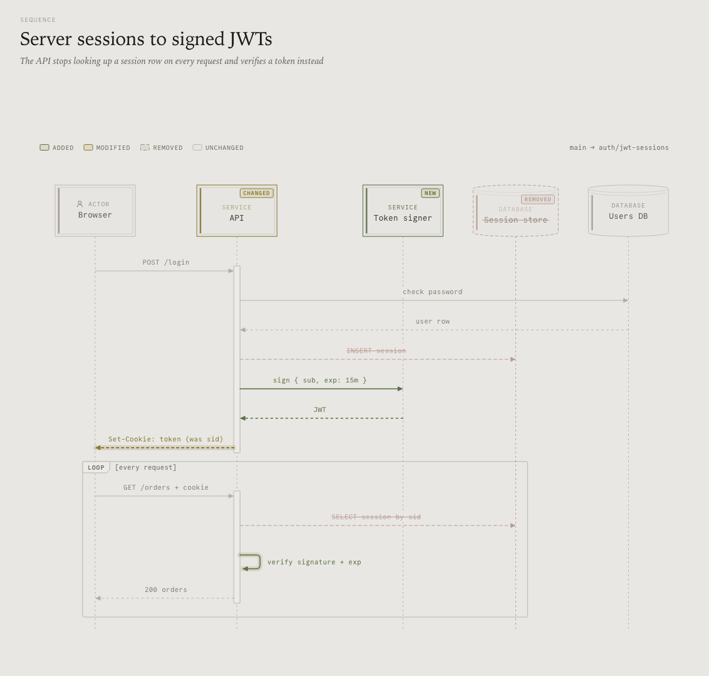</picture></td>
</tr>
</table>

```json
{
  "type": "dataflow",
  "title": "Batch sending",
  "change": { "base": "main", "head": "feat/batch", "title": "Send broadcasts in batches of 500" },
  "groups": [{ "id": "lib", "label": "broadcast-lib", "kind": "package", "delta": "added" }],
  "nodes": [
    { "id": "queue", "label": "broadcastQueue", "kind": "database", "delta": "modified",
      "stat": { "add": 21, "del": 4 }, "summary": "Queue documents gained batchSize." },
    { "id": "loop", "label": "processBroadcast", "kind": "function", "delta": "removed",
      "files": [{ "path": "functions/src/processBroadcast.ts", "lines": [1, 118], "revision": "base" }] },
    { "id": "bulk", "label": "sendBroadcastBulk", "kind": "function", "delta": "added", "parent": "lib",
      "files": [{ "path": "functions/src/sendBroadcastBulk.ts", "lines": [1, 142] }] },
    { "id": "postmark", "label": "Postmark", "kind": "external", "delta": "unchanged" },
    { "id": "logs", "label": "Logs", "kind": "store", "delta": "unchanged" }
  ],
  "edges": [
    { "from": "queue", "to": "loop", "delta": "removed" },
    { "from": "loop", "to": "postmark", "label": "1 msg/call", "delta": "removed" },
    { "from": "queue", "to": "bulk", "delta": "added" },
    { "from": "bulk", "to": "postmark", "label": "500 msgs/call", "delta": "added", "emphasis": "hero",
      "summary": "10,000 recipients now take 20 requests." },
    { "from": "bulk", "to": "logs", "delta": "added", "emphasis": "muted" }
  ]
}
```

| `delta` | look |
| --- | --- |
| `added` | sage outline and accent, `NEW` badge |
| `modified` | gold outline and accent, `CHANGED` badge |
| `removed` | a ghost: rose dashed outline, faded, label struck through, `REMOVED` badge |
| `unchanged` | receded context, no badge |

- `delta` goes on nodes, groups, edges, participants and messages (a group's label gets
  ` · NEW` / ` · CHANGED` / ` · REMOVED`).
- `stat: { add, del }` shows `+21 −4` beside the badge; `--changes` fills it from `files`.
- `summary` is one line of what changed and why (it becomes auto captions and the drawer text);
  `files` are `"src/x.ts"` or `{ "path", "lines": n | [a, b], "revision": "head" | "base" }`
  (head-side line numbers; base-side for removed elements).
- Edges and messages take `"emphasis": "hero"` (thicker, with a soft glow; keep it to 1–2, more is
  a warning) or `"muted"`.
- The root `change` (`{ "base", "head", "title", "url" }`) shows `main → feat/batch` next to an
  automatic legend of the deltas present; `"style": { "legend": false }` hides the legend.
- An `added` edge touching a `removed` node is an error. Specs without these fields render
  byte-identically, and deltas compose with stories, rich nodes and sequences.

```sh
storyink render examples/changes/batch-email.dataflow.json -o batch.html --svg batch.svg
```

Examples: [`examples/changes/`](examples/changes/):
[batch-email](examples/changes/batch-email.dataflow.json),
[auth-session-to-jwt](examples/changes/auth-session-to-jwt.sequence.json) (a sequence),
[rate-limit-plugin](examples/changes/rate-limit-plugin.architecture.json) (deltas on panel, code
and chip nodes and on groups). Spec: [change diagrams](docs/spec.md#change-diagrams).

## Diffs and diff code nodes

Point a change diagram at real code: parse the git diff once, give elements `files` and line
ranges, and let `--changes` fill in the numbers and embed the hunks. Nothing reads git when the
page is viewed.

<picture>
  <source media="(prefers-color-scheme: dark)" srcset="docs/gallery/storyink-core.architecture.dark.png">
  
</picture>

```sh
storyink diff                                    # working tree vs the merge base with origin/HEAD, main or master
storyink diff main...HEAD -o changes.json        # a..b, a...b (from the merge base), or one revision
storyink diff --staged --json                    # the index vs HEAD, printed as JSON
storyink diff v1.2.0 v1.3.0 -- src ':!docs'      # base and head, limited to pathspecs
git diff | storyink diff --patch - -o changes.json
storyink render examples/changes/storyink-core.architecture.json \
  --changes examples/changes/storyink-0.4.0.changes.json -o core.html
```

`storyink diff` prints the status, +/− and path of each file; `-o` writes the changes file (a
`DiffSet`). Untracked files are not included (`git add -N` them). `render --changes` takes that
file or a `.diff` / `.patch`, and:

- fills `stat` on elements that have `files` but no `stat`;
- resolves code nodes with `"diff": { "file", "lines" }` to the hunks in that range (± `context`,
  default 3);
- embeds the hunks any element references (at most 400 lines per file), so the
  [drawer](#narration-and-drawer) can show them;
- warns about changed files nothing points at, ranges that touch no hunk, and refs whose path is
  not in the diff.

**Diff code nodes.** A `code` node with `diff` shows a gutter of old | new line numbers, `+` / `−`
markers, sage and rose rows with stronger marks on the changed words, `@@` headers and syntax
colours, folding after `max` lines (4–200, default 24) with `… N more lines`.

```json
"nodes": [
  { "id": "state", "label": "storyState(t)", "kind": "service", "delta": "modified",
    "files": [{ "path": "src/core/story/state.ts", "lines": [211, 216] }] },
  { "id": "state-diff", "kind": "code", "label": "story/state.ts", "delta": "modified",
    "diff": { "file": "src/core/story/state.ts", "lines": [213, 216], "context": 2, "max": 24 } },
  { "id": "pay", "kind": "code", "label": "payments/charge.ts", "lang": "ts", "delta": "modified",
    "diff": "@@ -12,3 +12,6 @@ export async function charge(order)\n   const res = await stripe.charge(order)\n-  if (!res.paid) throw new PaymentError(res)\n+  if (!res.paid) {\n+    await retries.enqueue(order.id)\n+  }" },
  { "id": "frame", "label": "contentFrame", "kind": "function", "delta": "added" },
  { "id": "retries", "label": "payment-retries", "kind": "queue", "delta": "added" }
],
"edges": [
  { "id": "cf", "from": "state-diff#+215", "to": "frame", "delta": "added", "emphasis": "hero" },
  { "id": "enqueue", "from": "pay#+14", "to": "retries", "delta": "added" }
],
"story": { "steps": [
  { "at": 0.3, "line": "pay#-13", "caption": "Before: any decline threw", "stop": "Before" },
  { "apply": { "id": "pay", "hunk": 1, "cps": 60 }, "line": { "id": "pay", "off": true }, "stop": "Change" },
  { "line": "pay#+14", "wire": "enqueue" },
  { "apply": "state-diff" }
] }
```

- `diff` is unified hunk text (inline), `{ "file", "lines", "context", "max" }` (resolved by
  `--changes`; without it validation fails with a hint), or resolved `{ "file", "hunks" }`.
- **Anchors.** `node#+14` is head line 14 and `node#-13` base line 13; wires can leave from the
  changed line. `node#3` stays the third displayed row.
- **`apply`** plays the change: the node shows the base version until then, removed rows strike,
  added rows open and type in (`cps`, default 60), one hunk at a time with `"hunk": n`. `line`
  takes `#+14`, `#-13` or `{ "id", "hunk" }`. `set`, `clear` and `type` don't apply to diff nodes.
- **Languages.** `ts` (default) `js` `json` `py` `go` `rust` `sql` `yaml` `sh` `text`, with the
  aliases `python` `golang` `rs` `yml` `bash` `shell` `zsh` `typescript` `tsx` `javascript` `jsx`;
  diff nodes default to the file extension's language.

Examples: [payment-retry](examples/changes/payment-retry.architecture.json) (inline hunks),
[etl-dedupe](examples/changes/etl-dedupe.dataflow.json) (Python and SQL, one hunk at a time),
[storyink-core](examples/changes/storyink-core.architecture.json) with
[storyink-0.4.0.changes.json](examples/changes/storyink-0.4.0.changes.json). Spec:
[diffs and `--changes`](docs/spec.md#diffs-and---changes), [diff code nodes](docs/spec.md#diff-code-nodes).

## Change stories

Play a change instead of showing it all at once: each changed element keeps its before look until
a step changes it.

<picture>
  <source media="(prefers-color-scheme: dark)" srcset="docs/gallery/cache-layer.architecture.beats.dark.png">
  
</picture>

Derive the walkthrough from the deltas:

```json
"story": { "steps": "changes", "spotlight": "veil", "pace": 0.8 }
```

or write it, with `change` steps and a `focus` per step (the ids are
[payment-retry](examples/changes/payment-retry.architecture.json)'s; its story, shortened):

```json
"story": {
  "spotlight": "veil",
  "steps": [
    { "at": 0.3, "pulse": { "route": ["c-p", "p-s"] }, "caption": "Checkout charges the card through Payments", "stop": "Before" },
    { "change": ["payments", "pay-ts"], "focus": ["payments", "pay-ts"], "caption": "Now a soft decline is queued", "stop": "Change" },
    { "change": ["retries", "enqueue"], "line": "pay-ts#+14", "focus": ["pay-ts", "retries"] },
    { "change": ["worker", "consume", "worker-ts", "w-code", "w-p"], "line": { "id": "pay-ts", "off": true }, "focus": ["retries", "worker", "payments"], "stop": "Worker" },
    { "pulse": { "route": ["enqueue", "consume", "w-p"] }, "caption": "Declines loop back, off the request path" }
  ]
}
```

| delta | before | the `change` step |
| --- | --- | --- |
| `added` node / group | absent | reveals it |
| `added` edge / message | absent | draws it on |
| `removed` node | plain | fades to the struck-through ghost |
| `removed` edge / message | a plain wire | retracts, then the dashed ghost fades in |
| `modified` | plain | a flash, then the gold look and `CHANGED` badge |
| diff code node | the base version | `apply` |

- **`"story": "changes"`** (or `{ "steps": "changes", … }`, `--story changes`, tool
  `story: "changes"`) builds: an opening beat on the before state, captioned with `change.title`;
  one beat per changed node in data-flow order, with its changed edges and attached diff node
  (applied); a pulse train along each hero edge; a closing overview ("1 added · 2 changed ·
  1 removed"). Captions and [narration](#narration-and-drawer) come from each `summary`.
  Sequences get one beat per changed message.
- **`"spotlight": "veil"`** dims everything outside a soft cutout around each step's `focus` (a
  list is their union box); the cutout glides between steps and is gone in the final frame. HTML,
  snapshots and the animated SVG share it.

```sh
storyink render examples/changes/batch-email.dataflow.json --story changes -o batch-auto.html
```

Examples: [cache-layer](examples/changes/cache-layer.architecture.json) (the beat sheet above),
[batch-email.changes](examples/changes/batch-email.changes.dataflow.json),
[auth-session-to-jwt.changes](examples/changes/auth-session-to-jwt.changes.sequence.json),
[payment-retry](examples/changes/payment-retry.architecture.json) (hand-written). Spec:
[change stories](docs/spec.md#change-stories).

## Narration and drawer

For PR walkthroughs in the HTML viewer: a narration rail that follows the story, and a drawer with
the real hunks behind any changed box.

<table>
<tr>
<td valign="top"><picture><source media="(prefers-color-scheme: dark)" srcset="docs/gallery/storyink-0.4.0.rail.dark.png"></picture></td>
<td valign="top"><picture><source media="(prefers-color-scheme: dark)" srcset="docs/gallery/storyink-0.4.0.drawer.dark.png"></picture></td>
</tr>
</table>

```json
{ "reveal": ["graph", "panels"], "pulse": "validate->graph",
  "narrate": {
    "heading": "Layout sizes rich boxes",
    "body": "layoutGraph hands rich nodes to the new panels.ts, which measures headers, rows and code so a box fits its largest state and never resizes mid-story.",
    "cites": [
      { "text": "layoutGraph", "ref": "graph" },
      { "text": "panels.ts", "ref": "src/core/layout/panels.ts" }
    ] } }
```

- **`narrate`** is `{ heading?, body, cites? }` on a story step; `heading` defaults to the step's
  `stop`. Each cite's `text` must occur in the body, in order; its `ref` is an element id,
  `node#row`, or a file `path`, `path#L12` or `path#L12-20`. A narrated step without a `caption`
  captions with its heading, so beat sheets and the animated SVG show it too.
- **The rail** shows "02 / 07", the heading and the body; it follows playback and → / ←. Hovering
  a cite outlines its element; clicking a file cite opens it in the drawer. It sits beside the
  stage on wide screens and below it under 760 px; **Narration** in the toolbar or `N` toggles it.
- **The drawer** opens when you click (not drag) an element with a `summary`, `files` or a delta:
  kind, label, badge, stat, summary and each file ref. Rendered with `--changes`, each ref shows
  its hunks as a diff. × or Esc closes it.
- Both are HTML only. `#rail=0|1` and `#drawer=<id|path>` set them from the URL.

```sh
storyink render examples/changes/storyink-0.4.0.pr.json \
  --changes examples/changes/storyink-0.4.0.changes.json -o pr.html
storyink snapshot pr.html --rail --camera follow --at 9        # the rail shot above
storyink snapshot pr.html --drawer panels --camera follow --at end   # the drawer shot
```

Example: [storyink-0.4.0.pr](examples/changes/storyink-0.4.0.pr.json) (commit b526d50, 7 narrated
beats). Spec: [narration and drawer](docs/spec.md#narration-and-drawer).

## Pages

A page (`"type": "page"`) is an offline explainer document rendered from JSON: a summary first,
then sections of prose, data blocks and live figures. For PR reviews, plan reviews and recaps.

<table>
<tr>
<td valign="top"><picture><source media="(prefers-color-scheme: dark)" srcset="docs/gallery/pr-review.page.dark.png"></picture></td>
<td valign="top"><picture><source media="(prefers-color-scheme: dark)" srcset="docs/gallery/pr-review.page-diff.dark.png">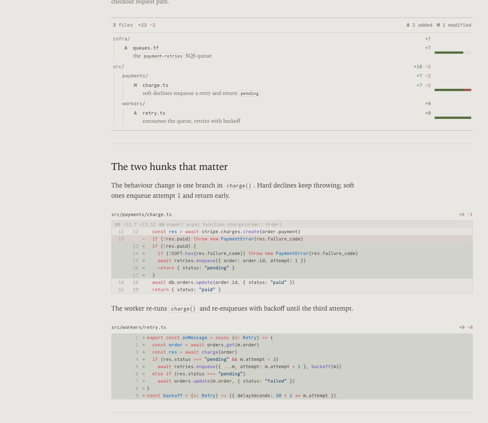</picture></td>
</tr>
</table>

```json
{
  "type": "page",
  "eyebrow": "Diff review",
  "title": "Payment retries move off the request path",
  "subtitle": "A soft card decline now queues a retry instead of failing the checkout.",
  "summary": "Checkout used to throw on **every** declined charge. Soft declines now wait on a queue.\n\nRecommendation: **approve with two follow-ups**.",
  "change": { "base": "main", "head": "payments/retry-queue" },
  "toc": true,
  "layout": "article",
  "present": true,
  "sections": [
    { "id": "what", "title": "What changed", "eyebrow": "Context", "blocks": [
      { "figure": { "id": "flow", "spec": "../changes/payment-retry.architecture.json",
                    "claim": "Declines now loop back through a queue, **off** the request path.", "wide": true } },
      { "filemap": "changes" }
    ] }
  ]
}
```

A block is an object with exactly one type key (plus an optional anchor `id`). One of each:

```jsonc
"blocks": [
  { "prose": "Checkout used to throw on **every** decline. *Soft* ones now retry:\n\n- `insufficient_funds`\n- `processing_error`" },
  { "figure": { "id": "flow", "spec": "flow.architecture.json", "claim": "Declines now loop back through a queue.", "wide": true } },
  { "kpis": [{ "label": "Files", "value": 3, "detail": "1 modified, 2 added" }, { "label": "Lines", "value": "+23 −2", "tone": "good" }] },
  { "table": { "columns": ["Concern", { "label": "Proposed", "align": "left" }], "rows": [["Staleness", { "text": "≤ 10 min", "tone": "warn", "badge": true }]], "caption": "Estimates, not measurements." } },
  { "cards": [{ "title": "Retry worker", "body": "Consumes the queue with backoff.", "tag": "worker", "tone": "good", "delta": "added" }] },
  { "callout": { "tone": "warn", "title": "Still open", "body": "A retried charge needs an idempotency key." } },
  { "filemap": { "files": [{ "path": "src/payments/charge.ts", "status": "modified", "add": 7, "del": 2, "note": "soft declines enqueue a retry" }] } },
  { "diff": { "file": "src/payments/charge.ts", "text": "@@ -13 +13 @@\n-  if (!res.paid) throw err\n+  if (!res.paid) return retry(order)" } },
  { "code": { "code": ["const backoff = (m) => 30 * 2 ** m.attempt"], "lang": "ts", "file": "src/workers/retry.ts", "start": 9 } },
  { "risks": [{ "risk": "A retry can double-bill.", "severity": "high", "area": "payments", "mitigation": "Idempotency key.", "refs": ["src/payments/charge.ts#L13"] }] },
  { "decisions": [{ "decision": "Only soft declines retry.", "why": "Hard declines never succeed.", "confidence": "sourced", "refs": ["src/payments/charge.ts#L14"] }] },
  { "evidence": [{ "claim": "Hard declines still throw.", "source": "src/payments/charge.ts#L14", "status": "verified" }] },
  { "timeline": [{ "when": "Phase 1", "title": "Cache reads behind a flag", "body": "Misses populate the key.", "tone": "note" }] },
  { "checklist": [{ "text": "Worker caps attempts at 3", "done": true }, { "text": "Idempotency key", "note": "blocking" }] },
  { "details": { "summary": "Why not a job table?", "blocks": [{ "prose": "SQS was already in the stack." }] } },
  { "columns": [[{ "prose": "**Before**: every read hits Postgres." }], [{ "prose": "**After**: Redis first, Postgres on a miss." }]] },
  { "scrolly": { "figure": { "spec": "flow.architecture.json" }, "steps": "auto" } },
  { "break": { "title": "Before merging", "layout": "flow" } }
]
```

- **Data blocks.** Tones are semantic: `good` sage, `warn` gold, `risk` rose, `note` blue,
  `neutral` ink. `severity` is `low` `medium` `high` `critical`; `confidence` is `sourced`
  `inferred` `unknown` (a `sourced` decision without `refs` warns); evidence `status` is `verified`
  `corrected` `unsupported` `unverifiable`. Refs such as `src/x.ts#L12-20` or `src/x.ts:12` render
  as mono refs. A `filemap` over 16 files shows the 8 largest and collapses the tree; `columns`
  takes 2–3 columns; `details` is collapsed (opened for print).
- **From a real diff.** These read the diff given to `render --changes`, which also resolves
  every figure (stat, diff nodes, drawer hunks):
  `{ "filemap": "changes" }`,
  `{ "filemap": { "from": "changes", "notes": { "src/x.ts": "…" } } }` and
  `{ "diff": { "file": "src/x.ts", "lines": [12, 20], "context": 2, "max": 24 } }`.
- **Prose** is a safe Markdown subset: paragraphs, `-` / `1.` lists, `###` / `####` headings,
  `>` quotes, bold, italic, `code` and links. No raw HTML.
- **Figures** are the full viewer, embedded: play, step, pan, open the drawer, and **Expand** to
  fill the window. `spec` is a diagram object or a path (JSON or `.mmd`) relative to the page
  file; `claim` is the caption, and should state the point; `id` defaults to `fig-1`, `fig-2`…;
  `wide: true` / `false` forces or prevents breaking out of the text column (by default, diagrams
  whose labels would be too small there break out); `builds: false` keeps a figure still in
  slides. Keys act on the figure you clicked; `#fig=<id>&t=9` targets one figure and
  `#fig=<id>&solo=1` shows it alone.
- Pages are HTML only: `--svg` / `--animated-svg` are errors, and `--story` / `--motion` /
  `--camera` / `--pace` are ignored with a warning (set them in each figure's spec).

```sh
storyink render examples/pages/pr-review.page.json -o pr-review.html
storyink render examples/pages/storyink-0.4.0.page.json \
  --changes examples/changes/storyink-0.4.0.changes.json -o commit-review.html
storyink validate examples/pages/cache-plan.page.json    # the page and every figure
storyink snapshot pr-review.html                          # the full page, per theme
storyink snapshot pr-review.html --figure retry-flow --sheet beats
```

Examples: [pr-review](examples/pages/pr-review.page.json) (a diff review),
[cache-plan](examples/pages/cache-plan.page.json) (a plan review with `columns`, `table` and
`timeline`), [storyink-recap](examples/pages/storyink-recap.page.json) (a project recap),
[storyink-0.4.0](examples/pages/storyink-0.4.0.page.json) (a commit review rendered with
`--changes`). Spec: [pages](docs/spec.md#pages),
[pages: viewer and page contract](docs/spec.md#pages-viewer--page-contract).

## Scrollytelling

A `scrolly` block pins a figure beside prose step cards; scrolling to a card moves the figure's
story to that card's beat (forward plays, backward rewinds).

<picture>
  <source media="(prefers-color-scheme: dark)" srcset="docs/gallery/payment-retry.scrolly.step3.dark.png">
  
</picture>

```json
{ "scrolly": {
    "id": "retry",
    "side": "right",
    "figure": { "id": "retry-flow", "spec": "../changes/payment-retry.architecture.json",
                "claim": "Declines loop back through Payments via a queue and a worker." },
    "steps": [
      { "at": "Before", "title": "Before", "body": "Checkout charges the card through **Payments**.",
        "cites": [{ "text": "Payments", "ref": "payments" }] },
      { "at": 2, "body": "Any decline threw a `PaymentError` straight back to checkout." },
      { "at": "Change", "title": "Soft declines wait", "body": "Now a soft decline goes on the new payment-retries queue.",
        "cites": [{ "text": "payment-retries queue", "ref": "retries" }] },
      { "at": "end", "title": "Off the request path", "body": "Declines loop back without holding the request open." }
    ] } }
```

- `at` is a story step `id`, a chapter `stop` label, a 1-based beat number, `"start"` (before the
  first beat) or `"end"`. Steps whose targets go backwards warn.
- `"steps": "auto"` makes one card per narrated step (title = heading, body, cites), or one per
  chapter `stop` with its caption, so a `story: "changes"` or a narrated figure becomes a scrolly
  for free.
- The figure needs a story. `cites` follow the `narrate` rules; hovering one highlights its
  element. A scrolly goes directly in a section's `blocks` (not inside `details` / `columns`).
- Without JavaScript, in print and with `#static=1`, the steps are listed beside the final frame.
  `#scrolly=<id>&step=<n>` opens on step n, settled.

```sh
storyink render examples/pages/payment-retry.scrolly.page.json -o scrolly.html
storyink snapshot scrolly.html --scrolly retry      # one 1280×800 frame per step + a sheet
```

Examples: [payment-retry.scrolly](examples/pages/payment-retry.scrolly.page.json),
[storyink-0.4.0.scrolly](examples/pages/storyink-0.4.0.scrolly.page.json) (`"steps": "auto"` from
a narrated story; render it with `--changes`). Spec:
[scrollytelling](docs/spec.md#scrollytelling),
[viewer](docs/spec.md#scrollytelling-and-slides-viewer).

## Slides

Any page presents as 16:9 slides from the same JSON: **Present** in the header, `P`, or
`#present=1`; `"layout": "slides"` opens presenting. A title slide, one slide per section, and a
new one at every `break`; a story figure's beats become the slide's builds.

<picture>
  <source media="(prefers-color-scheme: dark)" srcset="docs/gallery/pr-review.deck.slides.dark.png">
  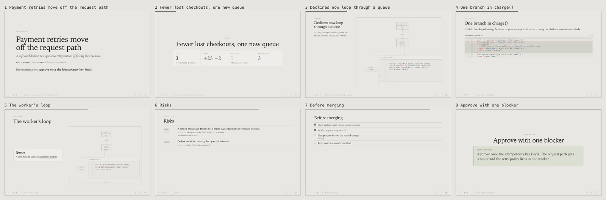
</picture>

<picture>
  <source media="(prefers-color-scheme: dark)" srcset="docs/gallery/pr-review.deck.slide3-build4.dark.png">
  
</picture>

```json
{
  "type": "page",
  "title": "Payment retries move off the request path",
  "layout": "slides",
  "sections": [
    { "id": "impact", "title": "Fewer lost checkouts, one new queue", "eyebrow": "Impact",
      "blocks": [{ "kpis": [{ "label": "Files", "value": 3 }, { "label": "Max attempts", "value": 3, "tone": "note" }] }] },
    { "id": "context", "title": "Declines now loop through a queue", "slide": { "layout": "full" },
      "blocks": [{ "figure": { "spec": "../changes/payment-retry.architecture.json", "claim": "Step through the change with →." } }] },
    { "id": "risks", "title": "Risks", "blocks": [
      { "risks": [{ "risk": "A retried charge can double-bill.", "severity": "high" }] },
      { "break": { "title": "Before merging", "layout": "flow" } },
      { "checklist": [{ "text": "Idempotency key on the retried charge", "note": "blocking" }] }
    ] }
  ]
}
```

| layout | for | picked when |
| --- | --- | --- |
| `title` | the title slide (the page header) | slide 1 |
| `full` | one figure filling the slide | the slide is only a figure (± its claim) |
| `split` | text left, figure right | a figure or scrolly with other blocks |
| `center` | a statement, KPIs or a callout, large | no figure and at most 2 short blocks |
| `flow` | everything else, top to bottom | otherwise |

- Override with `"slide": { "layout": … }` on a section or `layout` on a `break` (`auto` infers).
  `{ "break": true }` also works; a continuation slide's title defaults to the section's.
- **Builds.** → steps through the beats of the slide's first story figure (or its scrolly's steps)
  before the next slide; `"builds": false` on a figure turns that off.
- **Keys.** → Space PgDn Enter (next build, then next slide) · ← PgUp Backspace · Home / End ·
  O outline · ? help · Esc back to the article · P present / stop. The chrome shows a progress
  bar, `n / N`, prev / next and the slide title.
- `#present=1|0`, `#slide=<n>` (1 = the title slide) and `#build=<k>` (0 = entry) open a frame;
  `"present": false` turns presenting off. Slides whose content would need a scale under 0.7 are
  reported by the snapshot lint (`slide-overflow`).

```sh
storyink render examples/pages/pr-review.deck.page.json -o deck.html
storyink snapshot deck.html --slides             # one 1280×720 frame per slide + a labelled sheet
storyink snapshot deck.html --slides --builds    # every build state too
```

Example: [pr-review.deck](examples/pages/pr-review.deck.page.json). Spec:
[slides](docs/spec.md#slides), [viewer](docs/spec.md#scrollytelling-and-slides-viewer).

## Animated SVG (READMEs and PRs)

GitHub shows images in READMEs and PR comments as a plain `` through its camo proxy, so no
script runs and nothing outside the file loads. `--animated-svg` compiles the story into **SMIL**
inside one self-contained SVG that plays there:

```sh
storyink render examples/checkout.architecture.json --animated-svg docs/checkout.svg --theme both
# wrote docs/checkout.light.svg, docs/checkout.dark.svg and prints:
```

```html
<picture>
  <source media="(prefers-color-scheme: dark)" srcset="docs/checkout.dark.svg">
  
</picture>
```

<picture>
  <source media="(prefers-color-scheme: dark)" srcset="docs/gallery/cache-layer.architecture.animated.dark.svg">
  
</picture>

- An SVG image doesn't follow the page theme, so each file is **pinned** to one theme; the
  `<picture>` picks one. `--theme light|dark` writes a single file.
- It loops: story, a 3 s hold on the final frame, a 0.4 s reset. `--once` plays once and freezes.
- The attributes' base values are the final frame, so viewers without SMIL show the static diagram.
- Fonts: `--font system` (default) uses the system mono stack; `--font embed` embeds Commit Mono
  (+~127 KB) for the exact look. See the size table in [docs/spec.md](docs/spec.md#animated-svg).
- No story in the spec? The auto story is used (with a warning).
- Library: `renderAnimatedSvg(spec, { theme, once, font, hold, reset, fps })` from
  `storyink/core`; plugin: `storyink_render` with `animatedSvg: true | "both"`, `once`, `font`.
- GitHub's image proxy caches by URL: when a diagram changes, give it a new file name (or URL).
- Rich content (typing, status glyphs, line bars, spotlight), change looks, diff `apply` and the
  veil animate too. Frame parity is checked in headless Chrome; Firefox plays it in ``;
  Safari is untested. The glitch rewind, the follow camera, the narration rail and the drawer are
  HTML-only (a narrated step's heading becomes its caption).

## Snapshots and the agent loop

`storyink snapshot` opens the HTML in headless Chrome so you, or an agent, can look before
shipping: PNGs per theme, contact sheets, the in-page lint and a receipt with gates.

<picture>
  <source media="(prefers-color-scheme: dark)" srcset="docs/gallery/storyink-0.4.0.pr.beats.dark.png">
  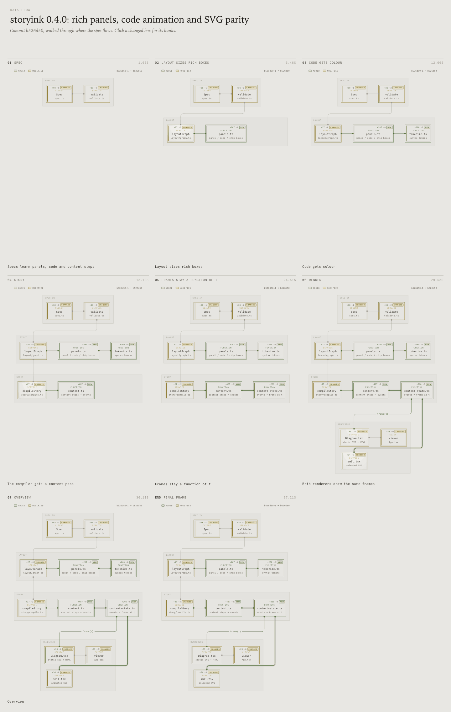
</picture>

```sh
storyink snapshot out.html                                   # light + dark PNGs and a light|dark sheet
storyink snapshot out.html --sheet beats                     # one tile per beat + the final frame
storyink snapshot out.html --at 1,2.5,end --scale 2          # stills at story times, 2× pixels
storyink snapshot out.html --at 6 --camera follow            # what a reader sees mid-story (16:9)
storyink snapshot out.html --at 6 --motion reduced           # a settled, stepped frame
storyink snapshot out.html --pace 0 --sheet beats            # pin the reading-hold pace
storyink snapshot pr.html --at 9 --rail                      # with the narration rail
storyink snapshot pr.html --at end --drawer panels           # with the drawer open (id or file path)
storyink snapshot page.html                                  # a page: the full page per theme
storyink snapshot page.html --figure fig-1 --sheet beats     # one figure, like a single diagram
storyink snapshot deck.html --slides --builds                # slide and build frames + sheets
storyink snapshot page.html --scrolly all                    # every scrolly step + sheets
storyink snapshot out.html --sheet beats --preview out.jpg   # one compact JPEG for a model
```

| gate | passes when |
| --- | --- |
| `ready` | the page hydrated and its fonts loaded |
| `lint` | no text or label overflow and no overlaps (`text-overflow`, `label-overflow`, `label-node`, `label-label`, `node-node`); pages also check clipped page text, and slides `slide-overflow` |
| `deterministic` | the same frame captured twice is identical |
| `end=static` | `t=end` matches the static diagram |
| `reduced=static` | the reduced-motion page shows the static diagram |
| `reduced=stepped` | reduced-motion frames mid-story show no pulse in flight |
| `follow-deterministic` | with `--camera follow`, every `at` frame re-captures identically |

Exit codes: 0 pass, 1 gate failed (or invalid input), 2 no browser. The browser is
`$STORYINK_CHROME`, then the newest Playwright `chrome-headless-shell`, then system Chrome
(`--headless=new`). `--width` sets the window (16:9 captures for `--camera follow`, `--rail` and
`--drawer`, default 1280×720), `-o` the output directory (default: next to the HTML) and `--json`
prints the receipt.

**The loop** ([skill/SKILL.md](skill/SKILL.md)): render, snapshot both themes, look at the image,
fix the spec (labels, `detail`, grouping, `direction`), and stop after three passes. Never
describe a frame you have not seen. `--preview` (in the plugin, the default inline image) keeps
it to one compact JPEG, 1024 px on its longest side unless `--preview-size` says otherwise.

## Options reference

Everything below is checked by `storyink validate` (JSON paths, messages and fix hints) and
described by [schema/storyink.schema.json](schema/storyink.schema.json); set `"$schema"` to it (or
to `https://unpkg.com/storyink/schema/storyink.schema.json`) for editor completion.

### Spec root

| field | value | notes |
| --- | --- | --- |
| `type` | `architecture` `dataflow` `workflow` `sequence` `lifecycle`, or `page` | required |
| `title` | string | required; the serif heading |
| `subtitle` | string | an italic line |
| `direction` | `TB` (`TD`) `BT` `LR` `RL` | graphs; omit to pick TB or LR by aspect (closest to 16:10) |
| `style` | `{ "arrowheads": bool, "legend": bool }` | graph arrowheads (default off); the change legend (default: on when any element has a delta) |
| `story` | `"auto"`, `"changes"` or [an object](#story) | opt-in |
| `change` | `{ "base", "head", "title", "url" }` | `base → head` (else `title`) above the diagram |
| `changes` | object | written by `--changes`; not hand-written |
| `$schema` | string | ignored by the renderer |
| `nodes` `edges` `groups` | arrays | graph types |
| `participants` `messages` `activations` `notes` `frames` `bands` `boxes`, `autonumber` | arrays, bool | sequences |

### Nodes, edges and groups

| node field | on | value |
| --- | --- | --- |
| `id` | all | letters, digits, `_ . : -`; unique across nodes and groups |
| `label` | all | defaults to `id`; wraps at 26 characters |
| `kind` | all | shape and accent ([kinds](#diagram-types)); default `service`, `step` or `state` |
| `detail` | all | a muted second line |
| `tag` | all | small uppercase tag; architecture and dataflow default it to the kind; `""` hides it |
| `parent` (alias `group`) | all | a group id, or a lifecycle `composite` node |
| `direction` | lifecycle `composite` | inner layout direction (best-effort) |
| `counter` | all | `{ "id", "value", "label", "prefix", "suffix" }`, rolled by story `counter` steps |
| `muted` | all | drawn at 0.42 at rest; a story `undim` lifts it |
| `icon` | `panel` `code` `chip` | `wrench` `plug` `file` `terminal` `search` `globe` `bolt` `user` `spark` |
| `rows` | `panel` | `[{ "id", "tag", "icon", "text", "detail", "status", "indent", "muted" }]`; row ids start with a letter or `_` |
| `code` | `code` | a string (split on newlines) or a list of lines |
| `lang` | `code` | [languages](#diffs-and-diff-code-nodes) |
| `size` | `panel` `code` | `{ "cols": 8–160, "lines": 1–60 }`; text wraps at `cols` (default 40) |
| `stack` | `chip` | 1–3 sheets peeking below |
| `diff` | `code` | unified hunk text, `{ "file", "lines", "context", "max" }`, or resolved `{ "file", "hunks" }` |
| `delta` `stat` `summary` `files` | all | [change diagrams](#change-diagrams) |

| edge field | value |
| --- | --- |
| `id` | default `"from->to"` (`#2`, `#3` for duplicates) |
| `from`, `to` | a node or group id, or an anchor: `panel#row`, `code#3`, `diff#+14`, `diff#-13` |
| `label` | string |
| `style` | `solid` (default) `dashed` `thick` |
| `arrow` | `end` (default) `none` `both`; drawn with `"style": { "arrowheads": true }` |
| `delta` `emphasis` `summary` `files` | [change diagrams](#change-diagrams) |

| group field | value |
| --- | --- |
| `id`, `label` | as for nodes |
| `kind` | free-form flavour shown after the label: `vpc`, `cluster`, `tier`, `region`… |
| `parent` | a parent group (nesting) |
| `direction` | inner layout direction (best-effort) |
| `bare` | label only, no box (a column heading) |
| `delta` | [change diagrams](#change-diagrams) |

### Sequence

| field | value |
| --- | --- |
| `participants` | `[{ "id", "label", "kind", "delta" }]`; kinds `participant` `actor` `service` `database` `queue` `external` |
| `messages` | `[{ "id", "from", "to", "label", "kind", "delta", "emphasis", "summary", "files" }]`; kinds `sync` `async` `return` `self` |
| `activations` | `[{ "participant", "start", "end" }]` |
| `notes` | `[{ "text", "over": [a] or [a, b], "left", "right", "after", "outside" }]` (one of `over` / `left` / `right`) |
| `frames` | `[{ "kind", "label", "start", "end", "sections": [{ "label", "start" }] }]`; kinds `alt` `opt` `loop` `par` `critical` `break` |
| `bands` | `[{ "start", "end", "label" }]`: a background band behind a message range |
| `boxes` | `[{ "label", "participants" }]`: a group of adjacent participants |
| `autonumber` | bool |

Message references (`start`, `end`, `after`) are 0-based indices or message ids.

### Story

| option | value | default |
| --- | --- | --- |
| `steps` | a list of steps, `"auto"` or `"changes"` | required |
| `autoplay` | bool | `false`: a click-to-play gate; `true` plays when scrolled into view |
| `end` | `hold` `loop` | `hold` |
| `pace` | 0–10 | 0.6 |
| `motion` | `full` `reduced` `system` | `full` |
| `camera` | `follow` `fit` | `follow` |
| `spotlight` | `true` or `"veil"` | off |
| `rewind` | `tape` `glitch` | `tape` (the HTML replay effect) |

`"story": "auto"` and `"story": "changes"` are shorthands for `{ "steps": "auto" }` and
`{ "steps": "changes" }`.

### Story steps

| field | value | does |
| --- | --- | --- |
| `id` | string | names the step (beat sheets, `__storyink.steps`, scrolly `at`) |
| `at` | seconds, or `"+x"` | start time; default `"+0"` after the previous step ends; with reading holds an absolute `at` is a minimum |
| `reveal` | id or list | appears (fade and rise): nodes, groups, edges, notes `note-<i>`, frames `frame-<i>` |
| `pulse` | edge id, `"from->to"`, a list, `{ "route": [...] }`, `{ "edge", "duration", "reverse", "delay" }` | a dot travels the wire and the target glows |
| `highlight` | ids, or `{ "ids", "for" }` | flood glow and text flash |
| `caption` | string | a line under the title |
| `counter` | `{ "id", "to" }` or a list | rolls a node counter |
| `stop` | string | a chapter: scrubber tick, beat-sheet title, Shift+→ / ← stop |
| `hold` | seconds, 0–60 | the reading hold after this beat (not scaled by `pace`) |
| `type` | id, or `{ "id", "by", "cps", "duration" }` | typewriter on a code node or a row (`by`: `char` `word`) |
| `set` | `{ "id", "code" }`, `{ "id", "text", "detail", "tag" }`, `{ "id", "label" }` | crossfades to new content |
| `clear` | id or list | fades content out |
| `line` | `"code#2"`, `"code#2-4"`, `"pay#+14"`, `{ "id", "lines" }`, `{ "id", "hunk" }`, `{ "id", "off": true }` | the active-line bar |
| `status` | `{ "id": "node#row", "to" }` | `none` `running` `done` `error` |
| `dim`, `undim` | ids, or `{ "ids", "to" }` | lower to a level (default 0.42) / back to full |
| `hide`, `show` | ids | take away / bring back something already there |
| `wire`, `unwire` | edge, or `{ "edge", "duration" }` | draw an edge on / retract it |
| `glow`, `unglow` | ids | a persistent glow |
| `focus` | id or list | where the follow camera, spotlight and veil aim |
| `change` | id or list | plays these elements' deltas |
| `apply` | id, `{ "id", "hunk", "cps" }`, or a list | plays a diff code node's change |
| `narrate` | `{ "heading", "body", "cites": [{ "text", "ref" }] }` | the narration rail |

Mistakes are diagnostics with a hint, never crashes: typing a cleared target, a line past the
end, `undim` on something not dimmed, a status that doesn't change.

### Pages and blocks

| page field | value | notes |
| --- | --- | --- |
| `type` | `"page"` | required |
| `title` | string | required |
| `eyebrow` | string | small uppercase line above the title (default "Page") |
| `subtitle` | string | an italic line |
| `summary` | prose | the lead paragraph, shown large |
| `change` | `{ "base", "head", "title", "url" }` | the change line in the header |
| `toc` | bool | default: a contents sidebar with 4 or more sections |
| `layout` | `article` `slides` | `slides` opens presenting |
| `present` | bool | default `true`; `false` removes Present, `P` and `#present=1` |
| `sections` | `[{ "id", "title", "eyebrow", "slide": { "layout" }, "blocks" }]` | required; `id` defaults to the title's slug |

Block types: `prose` `figure` `kpis` `table` `cards` `callout` `filemap` `diff` `code` `risks`
`decisions` `evidence` `timeline` `checklist` `details` `columns` `scrolly` `break`, with one
example of each [under Pages](#pages). Validation warns about long prose, more than 6 KPIs, more
than 4 figures, and `filemap` / `diff` from changes without `--changes`.

### CLI commands and flags

From `storyink --help`:

```
storyink render <in.json|in.mmd|-> [-o out.html] [--svg out.svg] [--theme light|dark] [--story auto|changes]
               [--motion full|reduced|system]   story playback motion (default full; system = OS setting)
               [--camera follow|fit]   viewer camera while playing (default follow)
               [--pace N]   reading holds after each beat × N (default 0.6; 0 = none)
               [--animated-svg out.svg [--theme light|dark|both] [--once] [--font system|embed]]
                 animated SVG (SMIL) for READMEs / PRs: plays inside , no script
               [--changes changes.json|x.diff|x.patch]   resolve files / stat / diff nodes from a diff
storyink render <page.json> [-o page.html] [--theme light|dark] [--changes changes.json]
                 a page ("type": "page"): prose, data blocks and figures; figure spec paths are
                 relative to the page file; HTML only (--svg / --animated-svg are errors)
storyink diff [<range>|<base> [<head>]] [--staged] [--patch file|-] [-o changes.json] [--json] [-- <pathspec>…]
                 parse git diff (default: working tree vs merge base with main/master)
storyink mermaid <in.mmd> [-o out.json]
storyink validate <in|page.json> [--json]
storyink snapshot <out.html> [--theme light,dark] [--width N] [--sheet [themes|beats]|--no-sheet]
                 [--at 0.5,1.2,end] [--motion reduced] [--camera follow] [--pace N] [--scale 2] [-o dir] [--json]
                 [--rail] [--drawer <id|path>]   narration rail / change drawer in the --at captures
                 [--figure <id>]   page HTML: snapshot one figure (default: full-page captures)
                 [--slides [--builds]] [--scrolly <id|all>]   page HTML: slide / build frames, scrolly steps + sheets
                 [--preview out.jpg [--preview-size 1024]]   compact one-image preview for agents
storyink skill            print the SKILL.md path and content
storyink --help | --version
```

`-` reads the spec from stdin; `.mmd` input is Mermaid. Without `-o`, `render` writes next to the
input (`x.json` → `x.html`). `--theme both` needs `--animated-svg`. `--pace` takes 0–10.
`--story`, `--motion`, `--camera` and `--pace` on a spec without a story are ignored with a warning
(add `--story auto`). Exit codes: 0 ok, 1 invalid input or a failed gate, 2 no browser.

### OpenCode tools

| tool | parameters |
| --- | --- |
| `storyink_render` | `output` (required); `spec` (object or JSON, a diagram or a page), `path` (a spec or page file) or `mermaid`; `svg`; `theme` (`light` `dark`); `story` (`auto` `changes`); `motion` (`full` `reduced` `system`); `camera` (`follow` `fit`); `pace` (0–10); `animatedSvg` (`true` or `"both"`); `animatedSvgPath`; `once`; `font` (`system` `embed`); `changes` (a changes file path or object, or a `.diff` / `.patch` path) |
| `storyink_diff` | `range`, `base`, `head`, `staged`, `patch` (diff text), `paths` (pathspecs), `output` |
| `storyink_from_mermaid` | `mermaid` (required), `output` |
| `storyink_validate` | `spec`, `mermaid` or `path` |
| `storyink_snapshot` | `html` (required); `themes`; `width`; `outDir`; `at`; `sheet` (`themes` `beats` `none`); `image` (`overview` `full` `none`); `maxImageSize` (256–2048, default 1024); `motion` (`full` `reduced`); `camera` (`fit` `follow`); `pace`; `rail`; `drawer`; `figure`; `slides`; `builds`; `scrolly` |

### Viewer keys

| key | diagram, or the focused figure on a page |
| --- | --- |
| `Space` | play / pause (opens the gate) |
| `→` / `←` | next / previous beat; with `Shift`, by chapter |
| `R` | replay |
| `M` | motion: full / reduced |
| `F` | follow camera on / off |
| `[` / `]` | shorter / longer reading pauses |
| `N` | narration rail |
| `0` | fit |
| `+` / `-` | zoom in / out (`=` and `_` work too) |
| `Esc` | close the drawer, then leave Expand |

Wheel zooms at the cursor and a drag pans; clicking (not dragging) an element with a `summary`,
`files` or a delta opens its drawer. On a page, keys act only on the figure you clicked (Space and the arrows scroll the page
otherwise), the wheel scrolls the page and Ctrl / ⌘ + wheel or a pinch zooms. While presenting:
`→` `Space` `PgDn` `Enter`, `←` `PgUp` `Backspace`, `Home` / `End`, `O`, `?`, `Esc` and `P`
([Slides](#slides)).

### URL hash

| key | value | does |
| --- | --- | --- |
| `theme` | `light` `dark` | pins the theme (page-wide on pages) |
| `chrome` | `0` | hides the toolbar |
| `t` | seconds or `end` | seeks, paused |
| `autoplay` | `0` `1` | overrides `story.autoplay` |
| `motion` | `full` `reduced` | overrides the motion mode |
| `camera` | `follow` `fit` | the follow camera; with `t`, `follow` shows the followed view |
| `pace` | a number | the reading-hold pace |
| `static` | `1` | story runtime off, the final frame (page-wide on pages) |
| `sheet` | `light,dark` or `beats` | both themes side by side, or one tile per beat |
| `rail` | `0` `1` | hides / shows the narration rail |
| `drawer` | an element id or file path | opens the drawer on load |
| `fig` | a figure id | pages: scopes `t`, `camera`, `motion`, `pace`, `drawer`, `rail`, `autoplay` and `static` to that figure |
| `solo` | `1` | pages, with `fig`: only that figure, full window |
| `present` | `1` `0` | pages: present, or force the article |
| `slide`, `build` | n, k | pages: open on slide n (1 = title) at build k (0 = entry) |
| `scrolly`, `step` | an id, n | pages: scroll that scrolly's step n to the trigger line, settled |

Snapshots also use `cols`, `range` and `zoom` (beat sheets) and `figmax` and `scroll` (pages).

### Page contract

`window.__storyink` gives `ready` / `whenReady`, `duration` and `steps`, `setTime(t)`, `play()`,
`pause()`, `replay()`, `step(dir, chapter?)`, `beats()`, `moveTo({ beat } | { t })`, `state()`,
`camera()`, `pace()` / `setPace(n)`, `openDrawer(id)` / `closeDrawer()` / `drawer()` and the
in-page `lint`; pages add `page: true`, `figures[id]` with the same API, and `deck` (`present`,
`exit`, `next`, `prev`, `state`). `document.documentElement.dataset.ready` is `"1"` once hydrated
and fonts are ready. Details: [docs/spec.md](docs/spec.md#page-contract-html).

## Install and use

### Library

```ts
import { validate, fromMermaid, renderHtml, renderSvg, renderAnimatedSvg, layout } from "storyink/core" // browser-safe
import { parseUnifiedDiff, resolveChanges, validatePage, renderPageHtml } from "storyink/core"
import { writeDiagram, writeAnimatedSvg, gitDiff, loadPage, writePage, snapshot, findBrowser } from "storyink/node" // Node only

const v = validate(spec) // { ok, diagnostics: [{ severity, path, message, hint }], spec }
const html = renderHtml(v.spec!) // standalone page; { theme } pins the first theme
const svg = renderSvg(v.spec!, { theme: "dark" }) // omit theme to follow prefers-color-scheme
const smil = renderAnimatedSvg(v.spec!, { theme: "light", once: false, font: "system" }) // plays in 
const scene = layout(v.spec!) // absolute geometry with stable ids (nodes, groups, edges, ports, labels)
const m = fromMermaid("flowchart LR\n a --> b") // { ok, spec, diagnostics }

const ds = gitDiff({ range: "main...HEAD" }) // or parseUnifiedDiff(text).diffset
const r = resolveChanges(spec, ds) // { spec, diagnostics }: stat, diff nodes, embedded hunks, coverage
const p = loadPage(pageJson, "docs/review", ds) // reads figure files relative to that directory
if (p.ok) writePage(p.page, "review.html") // or renderPageHtml(p.page) for the string
const shot = await snapshot("checkout.html", { at: [2.5, "end"], sheet: "beats" }) // { code, receipt, receiptPath }
```

`storyink/core` has no Node APIs. The viewer bundle and the font are compiled in as string
modules, so it works with bundlers and in the browser. `storyink` (the root export) re-exports the
core API plus `loadSpec`, `parseSource`, `writeDiagram`, `snapshot` and `findBrowser`, and has the
OpenCode plugin as its default export; `storyink/schema.json` is the JSON Schema. Runs on
Node ≥ 20 and Bun.

### CLI

```sh
npx storyink render spec.json -o out.html --svg out.svg     # or: npm i -g storyink
```

The full usage is in the [reference](#cli-commands-and-flags). Code changes:
`storyink diff main...HEAD -o changes.json`, then `render --changes changes.json` (see
[Diffs](#diffs-and-diff-code-nodes)). Looking at the result: [snapshots](#snapshots-and-the-agent-loop).

### OpenCode plugin

From npm, pinned or not:

```jsonc
// opencode.json (global ~/.config/opencode/ or project .opencode/)
{ "plugins": ["storyink"] }            // or "storyink@0.4.0"
```

From a local checkout, for development: build first, then point `plugins` at the **directory**
(OpenCode v2 accepts directories here, not single files):

```sh
cd ~/projects/storyink && bun install && bun run build
```

```jsonc
// <project>/.opencode/opencode.json
{ "plugins": ["/absolute/path/to/storyink"] }
```

OpenCode resolves a local plugin directory as `<dir>/server` and then `<dir>/index`. It does not
read `package.json` `main`, which is why the repo ships a root `server.js` that re-exports
`dist/index.js`. npm packages resolve `storyink/server` and then `storyink`, and both are exported.
Rebuild after changes, then restart the server (or touch the config) to reload.

This adds the tools `storyink_render`, `storyink_diff`, `storyink_from_mermaid`,
`storyink_validate` and `storyink_snapshot` ([parameters](#opencode-tools)).

- `storyink_render` takes a diagram or a page as `spec` (object or JSON) or `path`, renders with
  `changes` from `storyink_diff`, and can write the animated SVG.
- `storyink_diff` returns a compact summary (per-file status, +/−, hunk headers; never full hunks)
  and writes the changes file with `output`.
- `storyink_snapshot` returns **one compact preview image** so the model can see its own render: a
  JPEG no larger than `maxImageSize` (1024 px by default) on its longest side, and usually well
  under 300 KB. Beat sheets are reflowed into more columns so they fit in that single image. Set
  `image: "full"` to get the normal sheet layout instead, split into at most 3 parts, or
  `image: "none"` to get paths only. Full-resolution PNGs are never inlined; they stay on disk and
  their paths are listed. The CLI equivalent is `--preview out.jpg`. `figure`, `slides`, `builds`,
  `scrolly`, `rail` and `drawer` work as on the CLI.

The plugin also adds the `storyink` skill ([skill/SKILL.md](skill/SKILL.md)), which covers choosing
a diagram type, writing the spec, change diagrams, pages and the render → look → fix loop. If you
already have a skill with the id `storyink`, yours is kept. Relative paths resolve against the
project directory; a page given as `path` resolves its figure paths against the page file.

### Other agents

Use the CLI, and install the skill from the package:

```sh
npx storyink skill        # prints the SKILL.md path and its content
```

An MCP server is planned.

## Gallery

More renders from [`examples/`](examples), not shown above:

<table>
<tr>
<td valign="top"><picture><source media="(prefers-color-scheme: dark)" srcset="docs/gallery/cache.sequence.dark.png">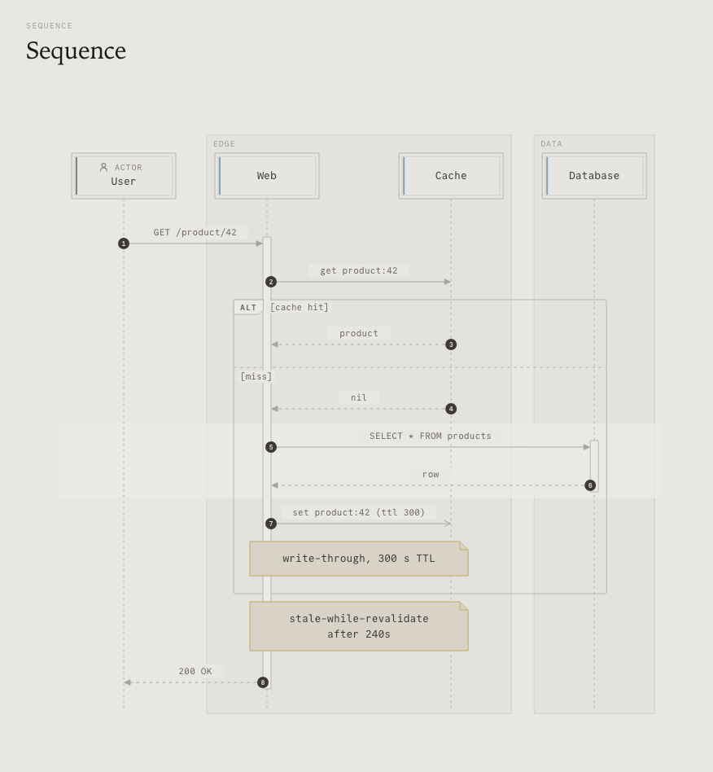</picture><br><a href="examples/mermaid/cache.sequence.mmd">cache.sequence.mmd</a></td>
<td valign="top"><picture><source media="(prefers-color-scheme: dark)" srcset="docs/gallery/incident.flowchart.dark.png">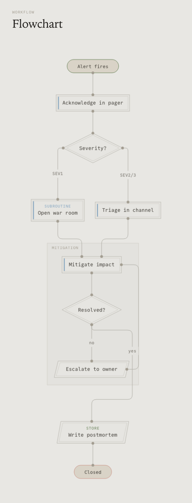</picture><br><a href="examples/mermaid/incident.flowchart.mmd">incident.flowchart.mmd</a></td>
<td valign="top"><picture><source media="(prefers-color-scheme: dark)" srcset="docs/gallery/etl-dedupe.dataflow.dark.png">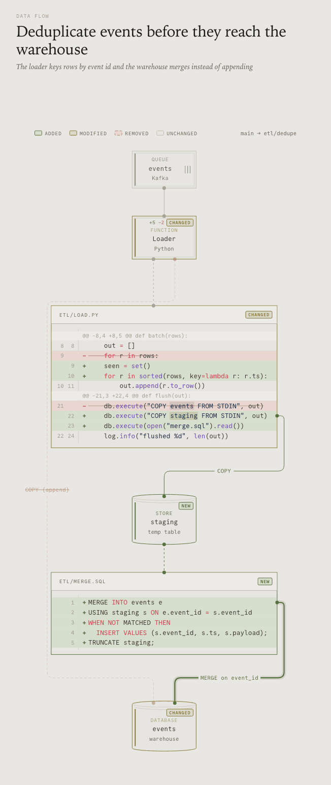</picture><br><a href="examples/changes/etl-dedupe.dataflow.json">etl-dedupe</a></td>
</tr>
<tr>
<td valign="top"><picture><source media="(prefers-color-scheme: dark)" srcset="docs/gallery/cache-layer.architecture.dark.png">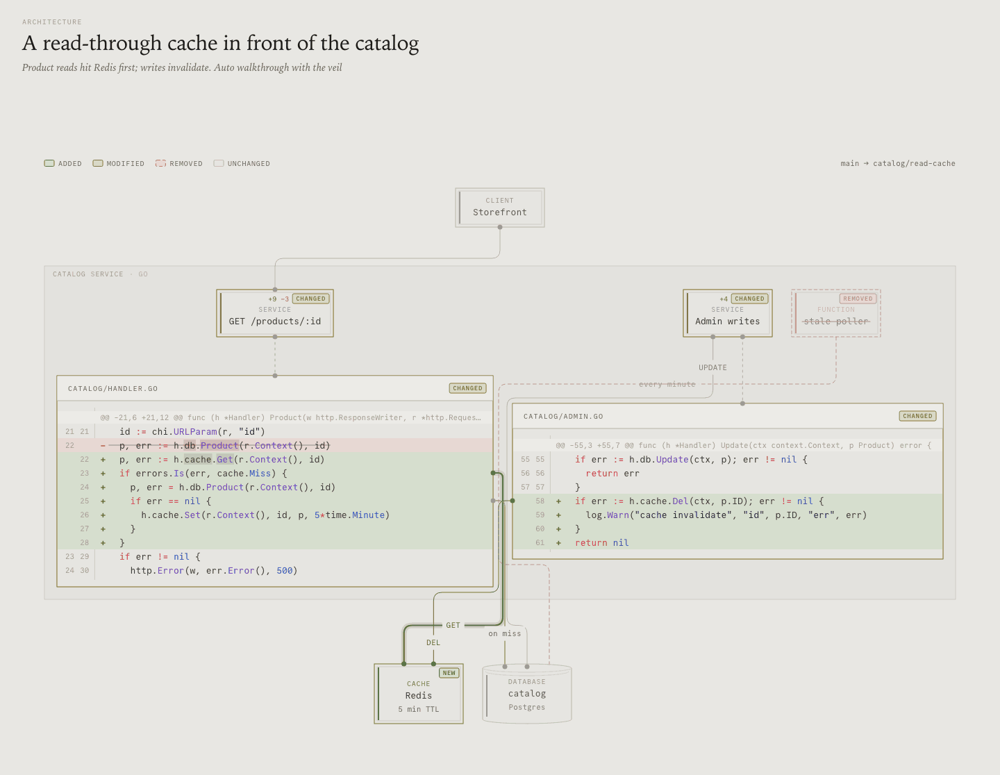</picture><br><a href="examples/changes/cache-layer.architecture.json">cache-layer</a></td>
<td valign="top"><picture><source media="(prefers-color-scheme: dark)" srcset="docs/gallery/rate-limit-plugin.architecture.dark.png">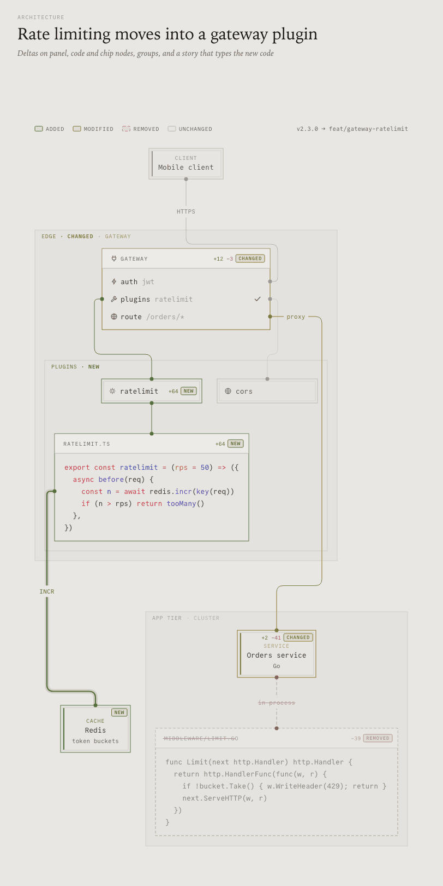</picture><br><a href="examples/changes/rate-limit-plugin.architecture.json">rate-limit-plugin</a></td>
<td valign="top"><picture><source media="(prefers-color-scheme: dark)" srcset="docs/gallery/payment-retry.architecture.dark.png">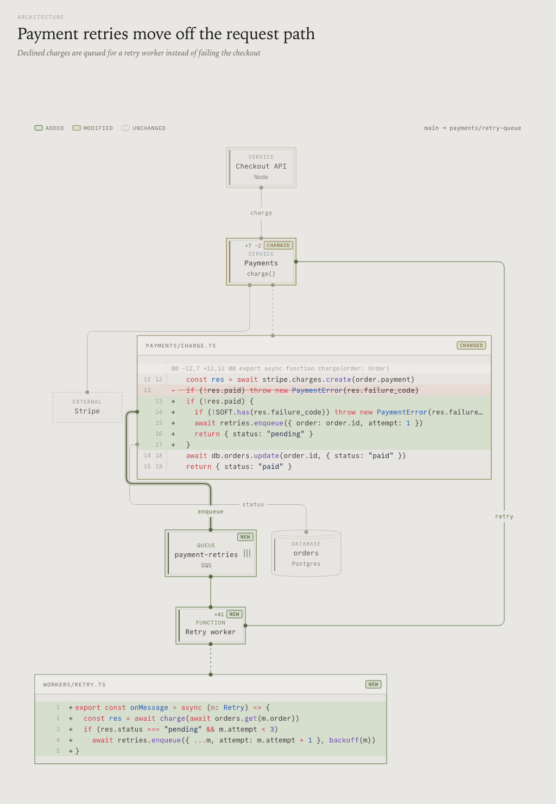</picture><br><a href="examples/changes/payment-retry.architecture.json">payment-retry</a></td>
</tr>
</table>

Every file in `docs/gallery/` comes as a `.light.` / `.dark.` pair (links below are to the light
file):

- **Beat sheets**: [checkout](docs/gallery/checkout.architecture.beats.light.png) · [oauth](docs/gallery/oauth.sequence.beats.light.png) · [order.state](docs/gallery/order.state.beats.light.png) (auto story) ·
  [batch-email](docs/gallery/batch-email.dataflow.beats.light.png) · [batch-email.changes](docs/gallery/batch-email.changes.dataflow.beats.light.png) · [auth-session-to-jwt](docs/gallery/auth-session-to-jwt.sequence.beats.light.png) ·
  [auth-session-to-jwt.changes](docs/gallery/auth-session-to-jwt.changes.sequence.beats.light.png) · [payment-retry](docs/gallery/payment-retry.architecture.beats.light.png) · [etl-dedupe](docs/gallery/etl-dedupe.dataflow.beats.light.png) ·
  [cache-layer](docs/gallery/cache-layer.architecture.beats.light.png) · [rate-limit-plugin](docs/gallery/rate-limit-plugin.architecture.beats.light.png) · [storyink-core](docs/gallery/storyink-core.architecture.beats.light.png) ·
  [storyink-0.4.0.pr](docs/gallery/storyink-0.4.0.pr.beats.light.png)
- **Static, change stories**: [batch-email.changes](docs/gallery/batch-email.changes.dataflow.light.png) · [auth-session-to-jwt.changes](docs/gallery/auth-session-to-jwt.changes.sequence.light.png) · [storyink-0.4.0.pr](docs/gallery/storyink-0.4.0.pr.light.png)
- **Animated**: [checkout](docs/gallery/checkout.architecture.animated.light.svg) · [checkout-recovery](docs/gallery/checkout-recovery.architecture.animated.light.svg) · [code-mode](docs/gallery/code-mode.architecture.animated.light.svg) ·
  [retry-helper](docs/gallery/retry-helper.architecture.animated.light.svg) · [agent-session](docs/gallery/agent-session.architecture.animated.light.svg) · [failover](docs/gallery/failover.dataflow.animated.light.svg) ·
  [oauth](docs/gallery/oauth.sequence.animated.light.svg) · [order.state](docs/gallery/order.state.animated.light.svg) (auto story) · [batch-email](docs/gallery/batch-email.dataflow.animated.light.svg) ·
  [batch-email.changes](docs/gallery/batch-email.changes.dataflow.animated.light.svg) · [auth-session-to-jwt](docs/gallery/auth-session-to-jwt.sequence.animated.light.svg) · [payment-retry](docs/gallery/payment-retry.architecture.animated.light.svg) ·
  [etl-dedupe](docs/gallery/etl-dedupe.dataflow.animated.light.svg) · [cache-layer](docs/gallery/cache-layer.architecture.animated.light.svg) · [rate-limit-plugin](docs/gallery/rate-limit-plugin.architecture.animated.light.svg) ·
  [storyink-core](docs/gallery/storyink-core.architecture.animated.light.svg) (resolved with `--changes`)

`bun run gallery` renders every example and Mermaid sample and writes a light and a dark PNG per
example to `docs/gallery/`, plus a beat sheet for each story (`storyink-*` change examples are
resolved against [the 0.4.0 diff](examples/changes/storyink-0.4.0.changes.json)).
`bun run gallery:animated` writes the animated SVGs of the story examples
(`*.animated.light.svg` / `*.animated.dark.svg`), and `bun run gallery:showcase` the PNGs of the
HTML-only features (rail, drawer, page, scrolly, slides). `--only name,…` writes just those.
`bun run verify:smil` checks the animated SVGs in headless Chrome (frame parity with the viewer's
frames, `` playback, embedded font).

## Spec

See [docs/spec.md](docs/spec.md) (the full reference, including layout and timing details) and
[schema/storyink.schema.json](schema/storyink.schema.json). Graph edges have no arrowheads by
default, matching Kit's style, and a graph without `direction` gets TB or LR, whichever is closer
to 16:10 ([Diagram types](#diagram-types)). Examples of each type are in [examples/](examples),
Mermaid samples in [examples/mermaid/](examples/mermaid), change diagrams in
[examples/changes/](examples/changes) and pages in [examples/pages/](examples/pages).

## Develop

```sh
bun install
bun test                   # generates src/generated/* first
bun run typecheck
bun run build              # dist/ (ESM for node, .d.ts, CLI with a node shebang)
bun run gallery            # docs/gallery/*.png (needs Chrome / Playwright headless shell)
bun run gallery:animated   # docs/gallery/*.animated.{light,dark}.svg
bun run gallery:showcase   # docs/gallery PNGs of the rail, drawer, pages, scrolly and slides
bun run verify:smil        # animated SVGs: frame parity,  playback, embedded font
bun run verify:viewer      # every viewer control with real mouse input, full and reduced motion
bun run verify:narrate     # narration rail and change drawer
bun run verify:page        # pages: embedded figures, focus, #fig= and solo
bun run verify:deck        # scrollytelling and slides
```

All design tokens (palette, type, geometry, motion) live in `src/theme/tokens.ts` and are
exported as CSS variables.

## License

MIT © 2026 grenaad. The bundled font and libraries are listed in
[THIRD_PARTY_NOTICES.md](THIRD_PARTY_NOTICES.md).
